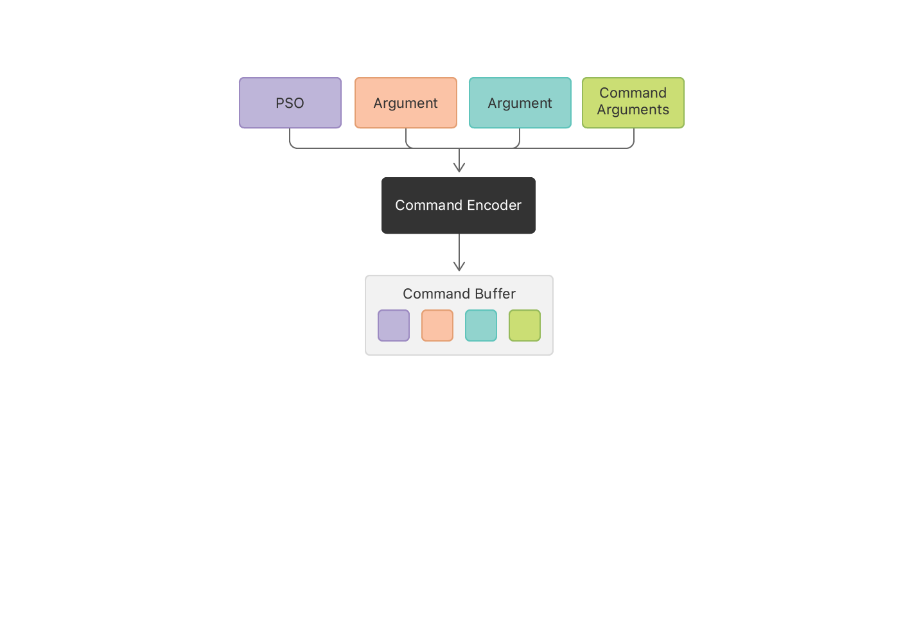

# 计算管线·入门

本文主要演示了如何驱动 GPU 进行大量数据的并行计算：将等长数组A、数组B 相加，得到数组 C。

一般而言，数组的计算都是在 CPU 中处理的，如下述函数：

```
void add_arrays(const float* arrayA,
                const float* arrayB,
                float* arrayC,
                int length) {
    for (int index = 0; index < length ; index++) {
        arrayC[index] = arrayA[index] + arrayB[index];
    }
}
```

但这种大批量的数据计算，使用GPU具有更高的并行效率！

## 计算着色器

使用关键字 `kernel` 声明一个计算着色器，用于在 GPU 上并行计算！
* 关键字 `device` ：表明这些数据存储在 GPU 寄存去中；
* 属性限定符 `[[thread_position_in_grid]]` 标明每个计算线程的唯一索引

``` metal
kernel void add_arrays(device const float* arrayA,
                       device const float* arrayB,
                       device float* arrayC,
                       uint index [[thread_position_in_grid]]) {
    arrayC[index] = arrayA[index] + inB[index];
}
```

## Find a GPU

MTLDevice 是对 GPU 的抽象对象，通过该对象可以直接与 GPU 通信！

``` objective-c
/// 获取一个 GPU 句柄
id<MTLDevice> device = MTLCreateSystemDefaultDevice();
```

## 计算管线
 
``` objective-c
{
    id<MTLLibrary> defaultLibrary = [_mDevice newDefaultLibrary];
    NSAssert(defaultLibrary, @"Failed to find the default library.");
    /// 获取计算着色器的句柄
    id<MTLFunction> addFunction = [defaultLibrary newFunctionWithName:@"add_arrays"];
    /// 创建一条计算管线
    _computePipelineState = [_mDevice newComputePipelineStateWithFunction:addFunction error:&error];
    NSAssert(_computePipelineState, @"Failed to created pipeline state object, error %@.", error);
    
    /// 命令队列：调度计算命令
    _commandQueue = [_mDevice newCommandQueue];
}
```

## 编码计算命令


```
/// 使用 GPU 计算
- (void)sendComputeCommand {
    /// 命令缓冲区
    id<MTLCommandBuffer> commandBuffer = [_commandQueue commandBuffer];
    id<MTLComputeCommandEncoder> computeEncoder = [commandBuffer computeCommandEncoder];

    [computeEncoder setComputePipelineState:_computePipelineState];
    [computeEncoder setBuffer:_mBufferA offset:0 atIndex:0];
    [computeEncoder setBuffer:_mBufferB offset:0 atIndex:1];
    [computeEncoder setBuffer:_mBufferResult offset:0 atIndex:2];

    MTLSize gridSize = MTLSizeMake(arrayLength, 1, 1);

    /// 线程组中的线程数
    NSUInteger threadGroupSize = MIN( _computePipelineState.maxTotalThreadsPerThreadgroup, arrayLength);
    /// 由于是计算一维数组，因此 height、depth 均设置为 1
    MTLSize threadgroupSize = MTLSizeMake(threadGroupSize, 1, 1);

    [computeEncoder dispatchThreads:gridSize threadsPerThreadgroup:threadgroupSize];

    // End the compute pass.
    [computeEncoder endEncoding];

    // Execute the command.
    [commandBuffer commit];

    /// 阻塞当前线程，等待任务完成
    [commandBuffer waitUntilCompleted];

    [self verifyResults];
}
```


## Create a Command Buffer
Ask the command queue to create a command buffer.

``` objective-c
id<MTLCommandBuffer> commandBuffer = [_mCommandQueue commandBuffer];
```

## Create a Command Encoder

To write commands into a command buffer, you use a *command encoder* for the specific kind of commands you want to code.
This sample creates a compute command encoder, which encodes a *compute pass*.
A compute pass holds a list of commands that execute compute pipelines.
Each compute command causes the GPU to create a grid of threads to execute on the GPU.

``` objective-c
id<MTLComputeCommandEncoder> computeEncoder = [commandBuffer computeCommandEncoder];
```

To encode a command, you make a series of method calls on the encoder.
Some methods set state information, like the pipeline state object (PSO) or the arguments to be passed to the pipeline.
After you make those state changes, you encode a command to execute the pipeline.
The encoder writes all of the state changes and command parameters into the command buffer.



## Set Pipeline State and Argument Data

Set the pipeline state object of the pipeline you want the command to execute.
Then set data for any arguments that the pipeline needs to send into the `add_arrays` function. 
For this pipeline, that means providing references to three buffers.
Metal automatically assigns indices for the buffer arguments in the order that the arguments appear in the function declaration in Listing 2, starting with `0`.
You provide arguments using the same indices.

``` objective-c
[computeEncoder setComputePipelineState:_mAddFunctionPSO];
[computeEncoder setBuffer:_mBufferA offset:0 atIndex:0];
[computeEncoder setBuffer:_mBufferB offset:0 atIndex:1];
[computeEncoder setBuffer:_mBufferResult offset:0 atIndex:2];
```

You also specify an offset for each argument.
An offset of `0` means the command will access the data from the beginning of a buffer.
However, you could use one buffer to store multiple arguments, specifying an offset for each argument.

You don't specify any data for the index argument because the `add_arrays` function defined its values as being provided by the GPU.

## Specify Thread Count and Organization

Next, decide how many threads to create and how to organize those threads.
Metal can create 1D, 2D, or 3D grids.
The `add_arrays` function uses a 1D array, so the sample creates a 1D grid of size (`dataSize` x 1 x 1), from which Metal generates indices between 0 and `dataSize`-1.

``` objective-c
MTLSize gridSize = MTLSizeMake(arrayLength, 1, 1);
```

## Specify Threadgroup Size

Metal subdivides the grid into smaller grids called *threadgroups*.
Each threadgroup is calculated separately.
Metal can dispatch threadgroups to different processing elements on the GPU to speed up processing.
You also need to decide how large to make the threadgroups for your command.

``` objective-c
NSUInteger threadGroupSize = _mAddFunctionPSO.maxTotalThreadsPerThreadgroup;
if (threadGroupSize > arrayLength)
{
    threadGroupSize = arrayLength;
}
MTLSize threadgroupSize = MTLSizeMake(threadGroupSize, 1, 1);
```

The app asks the pipeline state object for the largest possible threadgroup and shrinks it if that size is larger than the size of the data set.
The [`maxTotalThreadsPerThreadgroup`][maxTotalThreadsPerThreadgroup] property gives the maximum number of threads allowed in the threadgroup, which varies depending on the complexity of the function used to create the pipeline state object.

## Encode the Compute Command to Execute the Threads

Finally, encode the command to dispatch the grid of threads.

``` objective-c
[computeEncoder dispatchThreads:gridSize
          threadsPerThreadgroup:threadgroupSize];
```

When the GPU executes this command, it uses the state you previously set and the command's parameters to dispatch threads to perform the computation.

You can follow the same steps using the encoder to encode multiple compute commands into the compute pass without performing any redundant steps.
For example, you might set the pipeline state object once, and then set arguments and encode a command for each collection of buffers to process.

## End the Compute Pass
When you have no more commands to add to the compute pass, you end the encoding process to close out the compute pass.

``` objective-c
[computeEncoder endEncoding];
```

## Commit the Command Buffer to Execute Its Commands

Run the commands in the command buffer by committing the command buffer to the queue.

``` objective-c
[commandBuffer commit];
```

The command queue created the command buffer, so committing the buffer always places it on that queue.
After you commit the command buffer, Metal asynchronously prepares the commands for execution and then schedules the command buffer to execute on the GPU.
After the GPU executes all the commands in the command buffer, Metal marks the command buffer as complete.

## Wait for the Calculation to Complete

Your app can do other work while the GPU is processing your commands.
This sample doesn't need to do any additional work, so it simply waits until the command buffer is complete.

``` objective-c
[commandBuffer waitUntilCompleted];
```

Alternatively, to be notified when Metal has processed all of the commands, add a completion handler to the command buffer ([`addCompletedHandler`][addCompletedHandler]), or check the status of a command buffer by reading its [`status`][status] property.

## Read the Results From the Buffer

After the command buffer completes, the GPU's calculations are stored in the output buffer and Metal performs any necessary steps to make sure the CPU can see them.
In a real app, you would read the results from the buffer and do something with them, such as displaying the results onscreen or writing them to a file.
Because the calculations are only used to illustrate the process of creating a Metal app, the sample reads the values stored in the output buffer and tests to make sure the CPU and the GPU calculated the same results.

``` objective-c
- (void) verifyResults
{
    float* a = _mBufferA.contents;
    float* b = _mBufferB.contents;
    float* result = _mBufferResult.contents;

    for (unsigned long index = 0; index < arrayLength; index++)
    {
        if (result[index] != (a[index] + b[index]))
        {
            printf("Compute ERROR: index=%lu result=%g vs %g=a+b\n",
                   index, result[index], a[index] + b[index]);
            assert(result[index] == (a[index] + b[index]));
        }
    }
    printf("Compute results as expected\n");
}
```

[MTLDevice]: https://developer.apple.com/documentation/metal/mtldevice
[MTLCreateSystemDefaultDevice]: https://developer.apple.com/documentation/metal/1433401-mtlcreatesystemdefaultdevice
[MTLResource]: https://developer.apple.com/documentation/metal/mtlresource
[MTLBuffer]: https://developer.apple.com/documentation/metal/mtlbuffer
[MTLResourceStorageModeShared]: https://developer.apple.com/documentation/metal/mtlresourceoptions/mtlresourcestoragemodeshared
[MTLComputePipelineState]: https://developer.apple.com/documentation/metal/mtlcomputepipelinestate
[maxTotalThreadsPerThreadgroup]: https://developer.apple.com/documentation/metal/mtlcomputepipelinestate/1414927-maxtotalthreadsperthreadgroup
[status]: https://developer.apple.com/documentation/metal/mtlcommandbuffer/1443048-status
[addCompletedHandler]: https://developer.apple.com/documentation/metal/mtlcommandbuffer/1442997-addcompletedhandler
[MTLLibrary]: https://developer.apple.com/documentation/metal/mtllibrary
[MTLFunction]: https://developer.apple.com/documentation/metal/mtlfunction
[HelloTriangle]: https://developer.apple.com/documentation/metal
