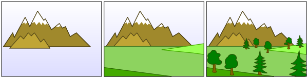
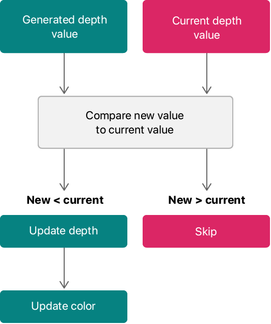
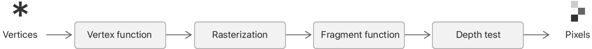
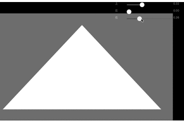

# 深度测试

> 像素不止携带 RGBA 信息，还有深度值，模板值等。

# 1、前言

## 1.1、画家算法

__画家算法__：首先绘制距离较远的场景，然后用绘制距离较近的场景覆盖较远的部分！

通常对于每一层`layer`，渲染器会遵循 _画家算法_，按次序输出到`Framebuffer`，后一层覆盖前一层，就能得到最终的显示结果。



针对复杂的 3D 场景，画家算法如何确定哪个场景远？哪个场景近？换句话说：当图元相互重叠时，画家算法如何选择要绘制的图元、如何确定要抛弃的图元？

在图形学中使用 __深度__ 来确定 __从观察点到特定像素的距离__:
* 深度值越小，离用户越近，需要被渲染；
* 深度值越大，离用户越远，可以被抛弃；



在 Metal 中使用深度测试来确定每个片元在渲染流水线中最终的可见性，实现复杂 3D 场景中物体的遮挡效果！如果没有深度测试，场景前边的物体不会挡住后边的物体；同一个物体前边的部分也不会挡住后边的部分，会使物体出现显示不全、闪烁等一些不好的现象。


## 1.2、缓冲区

__帧缓冲区__ 由许多缓冲区构成，这些缓冲区大致分为：
* 颜色缓冲区：用于绘图的缓冲区，它包含了颜色索引或者RGBA颜色数据;
* 深度缓冲区：存储每个像素的深度值; 当启用深度测试时，片元像素深度值和深度缓冲区深度值进行比较，决定片元哪些像素点数据可以替换到颜色缓冲区中。
* 模板缓冲区：就像对缕空纸板喷漆一样，当启用 模板测试时，通过模板测试的片元像素点会被替换到颜色缓冲区中，从而显示出来，未通过的则不会保存到颜色缓冲区中，达到过滤的功能。
* 累积缓冲区：累积缓冲区允许你把渲染到颜色缓冲区的值，拷贝到累积缓冲区。在多次拷贝操作到累积缓冲区时，可以用不同方式的把颜色缓冲区内容和当前累积缓冲区的内容进行重复混合；

# 2、深度测试

我们知道，一个3D物体的坐标需要经过 `模型坐标 -> 世界坐标 -> 观察坐标 -> 投影坐标 -> 剪裁空间坐标 -> 屏幕坐标` 的层层转换！

像素的深度值本质就是 3D 物体在剪裁空间的 Z 值 `[0, 1]` （其中 0 是近剪裁平面、1 是远剪裁平面）！

深度缓冲区存储着每个像素的深度值，渲染一个像素时会与深度缓冲区的深度值比较：
* 如果符合预设的比较结果，就认为测试通过，然后用当前像素的深度值替换深度缓冲中的像素值；
* 如果测试不通过，就丢弃当前像素的深度值；
* 通过深度测试决定重叠的图元哪些像素是可见的。

通过 [示例程序](https://github.com/Kanthine/MetalCode/tree/main/DepthTest) 演示在 Metal 中如何进行深度测试：
* UI 操作更改三角形每个顶点的深度值；
* 渲染每帧数据时，清除深度纹理数据，然后渲染一个灰色正方形（深度值固定为 0.5）；
* 最后渲染三角形；
* UI效果：只有比灰色方块深度值更小的片元是可见的。

## 2.1、深度缓冲区

`MTKView` 默认不会创建深度纹理，需要开发者通过 `MTKView.depthStencilPixelFormat` 设置深度纹理的数据格式；然后由`MTKView`自动创建和管理深度纹理。

```
/// 使用 32 位浮点值存储片元的深度值，
mtkView.depthStencilPixelFormat = MTLPixelFormatDepth32Float;
```

可以使用 16位、24位、32位来存储深度值：
* 位数越小，系统开销越小；
* 位数越大，保存的浮点值越多，可以避免深度冲突；


### 深度冲突

一个很常见的视觉错误会在两个平面或者三角形非常紧密地平行排列在一起时会发生，深度缓冲没有足够的精度来决定两个形状哪个在前面。
结果就是这两个形状不断地在切换前后顺序，这会导致很奇怪的花纹。这个现象叫做 __深度冲突__(Z-fighting)，因为它看起来像是这两个形状在争夺(Fight)谁该处于顶端。

在我们一直使用的场景中，有几个地方的深度冲突还是非常明显的。
箱子被放置在地板的同一高度上，这也就意味着箱子的底面和地板是共面的(Coplanar)。
这两个面的深度值都是一样的，所以深度测试没有办法决定应该显示哪一个。

如果你将摄像机移动到其中一个箱子的内部，你就能清楚地看到这个效果的，箱子的底部不断地在箱子底面与地板之间切换，形成一个锯齿的花纹！

深度冲突是深度缓冲的一个常见问题，当物体在远处时效果会更明显（因为深度缓冲在z值比较大的时候有着粗粒度的精度）。
深度冲突不能够被完全避免，但一般会有一些技巧有助于在你的场景中减轻或者完全避免深度冲突。

* 1、__永远不要把多个物体摆得太靠近，以至于它们的一些图元会重叠__。通过在两个物体之间设置一个用户无法注意到的偏移值，你可以完全避免这两个物体之间的深度冲突。在箱子和地板的例子中，我们可以将箱子沿着正y轴稍微移动一点。箱子位置的这点微小改变将不太可能被注意到，但它能够完全减少深度冲突的发生。然而，这需要对每个物体都手动调整，并且需要进行彻底的测试来保证场景中没有物体会产生深度冲突。
* 2、__尽可能将近平面设置远一些__。在前面我们提到了精度在靠近近平面时是非常高的，所以如果我们将近平面远离观察者，我们将会对整个平截头体有着更大的精度。然而，将近平面设置太远将会导致近处的物体被裁剪掉，所以这通常需要实验和微调来决定最适合你的场景的近平面距离。
* 3、__使用更高精度的深度缓冲__。大部分深度缓冲的精度都是24位的，但现在大部分的显卡都支持32位的深度缓冲，这将会极大地提高精度。所以，牺牲掉一些性能，你就能获得更高精度的深度测试，减少深度冲突。


## 2.2、渲染管线需要配置深度缓冲区的像素格式

如果进行深度测试，渲染管线有必要清楚深度纹理格式的信息，以便它可以读取或写入纹理中的值；在创建渲染管道时需要指定深度格式：

``` 
{
    MTLRenderPipelineDescriptor *pipelineStateDescriptor = [[MTLRenderPipelineDescriptor alloc] init];
    pipelineStateDescriptor.label = @"Render Pipeline";
    pipelineStateDescriptor.sampleCount = mtkView.sampleCount;
    pipelineStateDescriptor.vertexFunction = vertexFunction;
    pipelineStateDescriptor.fragmentFunction = fragmentFunction;
    pipelineStateDescriptor.colorAttachments[0].pixelFormat = mtkView.colorPixelFormat;

    /// 与上文的深度纹理数据格式统一
    pipelineStateDescriptor.depthAttachmentPixelFormat = mtkView.depthStencilPixelFormat;
    pipelineStateDescriptor.vertexBuffers[AAPLVertexInputIndexVertices].mutability = MTLMutabilityImmutable;

    NSError *error;
    _pipelineState = [_device newRenderPipelineStateWithDescriptor:pipelineStateDescriptor error:&error];
}
```

在渲染管线中指定深度格式时，Metal 会在渲染管线上执行额外的操作流程（深度测试）：



## 2.3、深度测试的管理对象

在 Metal 中需要创建`MTLDepthStencilState`管理深度测试，由于对象的创建是一个耗时操作，通常在初始化应用时创建。

```
{
    MTLDepthStencilDescriptor *depthDescriptor = [MTLDepthStencilDescriptor new];
    /// LessEqual 如果新值小于或等于现有值，则通过深度测试
    depthDescriptor.depthCompareFunction = MTLCompareFunctionLessEqual;
    depthDescriptor.depthWriteEnabled = YES;
    _depthState = [_device newDepthStencilStateWithDescriptor:depthDescriptor];
}
```

### 深度值比较规则

一般而言，越小深度值能通过深度测试，但这不是绝对的！可以通过配置比较策略，实现自定义的深度测试：

```
/// 测试通过的比较策略
typedef NS_ENUM(NSUInteger, MTLCompareFunction) {
    MTLCompareFunctionNever = 0,        /// 新值永远不会通过测试
    MTLCompareFunctionLess = 1,         /// 如果新值小于现有值，则新值通过测试
    MTLCompareFunctionEqual = 2,        /// 如果新值与现有值相等，则新值通过测试
    MTLCompareFunctionLessEqual = 3,    /// 如果新值小于或等于现有值，则新值通过测试
    MTLCompareFunctionGreater = 4,      /// 如果新值大于现有值，则新值通过测试
    MTLCompareFunctionNotEqual = 5,     /// 如果新值不等于现有值，则新值通过测试
    MTLCompareFunctionGreaterEqual = 6, /// 如果新值大于或等于现有值，则新值通过测试
    MTLCompareFunctionAlways = 7,       /// 新值总是通过测试
};
```

## 2.4、顶点着色器输出深度值

像素的深度值本质就是裁空间坐标系下的 z 坐标值。

``` 
vertex RasterizerData
vertexShader(uint                      vertexID     [[ vertex_id ]],
             const device AAPLVertex * vertices     [[ buffer(AAPLVertexInputIndexVertices) ]],
             constant vector_float2   &viewportSize [[ buffer(AAPLVertexInputIndexViewport) ]]) {
    /// 坐标系转换
    float2 position = vertices[vertexID].position.xy / viewportSize * 2.0;
    position.x = position.x - 1.0;
    position.y = 1.0 - position.y;
    
    RasterizerData out;
    
    /// z 坐标就是表示剪裁空间的深度值
    out.position = vector_float4(position, vertices[vertexID].position.z, 1.0);
    out.color = vertices[vertexID].color;
    return out;
}
```

在 [三角形渲染](https://github.com/Kanthine/MetalCode/tree/main/DrawTriangle) 中介绍了“在光栅化阶段如何对颜色进行插值”！同样的，深度值也会在光栅化阶段被平滑插值！


开发者可以在根据需要，片段着色器读取、忽略或修改 z 值：
* 如果不修改栅格化阶段的插值，GPU 有时可以执行额外的优化：例如，它可以在运行片段着色器之前执行 z 测试，这样它就不会为隐藏的片元运行片段着色器；
* 如果在片段着色器中改变深度值，可能会导致性能下降，因为 GPU 必须先执行片段着色器；


## 2.5、重置深度缓冲区

renderPass 包括目标纹理，深度纹理等。如果启用深度测试，需要在 renderPass 中配置深度渲染目标
* mtkView 自动配置深度渲染目标指向深度纹理；
* renderPass 在每帧开始时重置深度缓冲区；

开发者需要提供一个默认的深度值 `[0, 1]`，在每帧开始前重置深度缓冲区时使用！

``` 
/// 0 是近剪裁平面，离用户最近
/// 1 是远剪裁平面，离用户最远
mtkView.clearDepth = 1.0;
```

当 GPU 开始渲染时，深度缓冲区中的每个像素值都被重置为 `1.0` 。

## 2.6、编码绘图命令

渲染命令编码器，还需要设置深度测试。

``` 
[renderEncoder setDepthStencilState:_depthState];
```



该例子使用着色器编码两个绘制命令。
* 首先渲染一个 `depth= 0.5` 的四边形，因为所有这些值都小于默认值，四边形总是被绘制到渲染目标中，深度值总是被更新。
* 然后在用户界面中指定的深度值渲染一个三角形。
* 如果将三角形的某顶点深度值增加到 `0.5` 以上，该部分无法通过深度测试、就会消失。


# 3、深度测试 API

使用 [MTLDepthStencilDescriptor](https://developer.apple.com/documentation/metal/mtldepthstencildescriptor?language=objc) 定义渲染管道的深度测试与模版测试的特定配置！

```
@interface MTLDepthStencilDescriptor : NSObject <NSCopying>

/// 默认为MTLCompareFuncAlways，新值总是通过测试
@property (nonatomic) MTLCompareFunction depthCompareFunction;

/// 默认为 NO，不执行深度写入
@property (nonatomic, getter=isDepthWriteEnabled) BOOL depthWriteEnabled;

/// 模板状态分前模和后模。通过给前后两者分配相同的 MTLStencilDescriptor，可以使前后两者跟踪相同的状态
@property (copy, nonatomic, null_resettable) MTLStencilDescriptor *frontFaceStencil;
@property (copy, nonatomic, null_resettable) MTLStencilDescriptor *backFaceStencil;

/// 标识符，用于调试程序
@property (nullable, copy, nonatomic) NSString *label;

@end

/// 设备指定的编译深度/模板状态对象
@protocol MTLDepthStencilState <NSObject>

/// 标识符，用于调试程序
@property (nullable, readonly) NSString *label;

/// 持有创建该资源的设备
@property (readonly) id <MTLDevice> device;

@end
```
