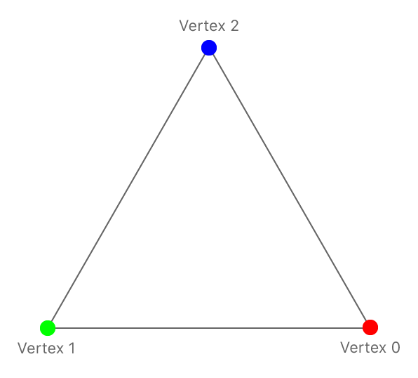

# 三角形绘制

在[Demo](https://github.com/Kanthine/MetalCode/tree/main/DrawTriangle)中，我们演示了如何创建渲染管线，如何使用顶点着色器、片段着色器绘制一个简单的三角形！
* 抹去了背景色 `view.backgroundColor`; 
* 如何创建一个持有 _顶点着色器_ 、 _片段着色器_ 的 _渲染管线_；
* 如何通过 renderPass 绘制一个简单的三角形；

该示例为每个顶点提供了位置和颜色，渲染管道使用该数据来渲染三角形，在为三角形顶点指定的颜色之间插入颜色值。

# 1、Metal 的渲染管线

绘制图形需要对数据映射、变换等处理，将这一系列的流水线抽象成 __渲染管线__ ！


渲染管线有许多阶段：
* 应用层的数据传递到顶点着色器 `Vertex Shader` ；
* 顶点着色器 `Vertex Shader` 采用控制反转，将数据的处理交给开发者；
    * 在该阶段需要处理每个顶点的坐标：物体坐标 => 世界坐标 => 观察坐标 => 裁剪空间坐标；
    * 将最终换算好的坐标注入渲染管线；
    * 开发者通过对坐标的转换处理，可以绘制出各种炫彩的图案！
* 接着进入图元组装 `Primitives Assembly`，将位置、索引等信息组成三角形；
    * 两点成线、三点定面；三角形是最基本的图元；
* 光栅化 `Rasterization` 将三角形映射到片元；光栅化可以对图元做 `Cull`、 `Clip`等操作；
    * 超出视口、超出剪裁空间的顶点数据不被用户所感知，可以裁剪掉；
* 经过光栅化之后，进入片段着色器 `Fragment Shader`，为每一个片元上色；
    * 可以简单的为每个顶点设置一个颜色；
    * 也可以贴上纹理；
    * 开发者为每个片元上色之后，交由 `Fragment Operation` 着色；
    * `Fragment Operation` 根据深度做出取舍，被遮挡的部分不会显示；或者颜色混合；
* 最后形成一个 `Frame Buffer`，写到内存中； 
* GPU 从内存中读取 `Frame Buffer` 显示一帧图像；


> 在 Metal 中，在 GPU 上运行的代码称为 __着色器__ ！


而 Metal 的渲染管线主要侧重于三个阶段：
* 顶点着色器 `Vertex Shader`：转换坐标；
* 光栅化阶段 `Rasterization`：对图元的离散化，并进行 `Cull`、 `Clip` 、插值等操作；
* 片段着色器 `Fragment Shader`：为片元颜色；

`Metal Shading Language` 是 C++ 的一种变体，专为 GPU 编程而设计，要在 GPU 上执行计算，需要使用 MSL 函数；开发者可以为顶点着色器与片段着色器编写  `MSL` 函数！


# 2、顶点着色器

顶点着色器每次生成一个顶点数据，片段着色器每次为一个片元着色。开发者需要构思一个目标：希望渲染管线的各个阶段生成什么，以及如何生成这些结果。

决定哪些数据要传递到渲染管线，哪些数据在渲染管线之间传递。通常有三个地方可以这样做:

* 管线的输入数据，由应用程序提供并传递到顶点着色器；
* 顶点着色器的输出数据，传递到光栅化阶段；
* 片段着色器的输入数据：
    * 纹理由应用程序输入；
    * 顶点或者色值等其它数据：由顶点着色器输入、光栅化阶段处理；
* 片段着色器为光栅化后的片元着色，因此返回一个 `float4(r, g, b, a)` 即可！


## 2.1、定义顶点着色器的输入数据结构

在本例中，管道的输入数据包含三角形顶点位置以及颜色（注意：坐标需要适配 Metal 坐标系）。

```
/// 定义顶点着色器接收的数据类型
typedef struct {
    vector_float2 position; /// 顶点位置
    vector_float4 color;    /// 颜色
} AAPLVertex;
```

SIMD 类型在 `Metal Shading Language` 中很常见，该类型包含特定数据类型的多个通道：
* 位置有 x 和 y 坐标，有两个 32 位浮点值，声明类型为 `vector_float2` ；
* 颜色有四个通道：`red`、`green`、`blue`、`alpha`，使用 `vector_float4` 存储；

## 2.2、应用层传入顶点数据

使用三个顶点绘制一个三角形！
* 这些顶点坐标，是相对于 UIView 坐标系的坐标，以左上角为坐标原点；
* 坐标值以像素为单位；




```
static const AAPLVertex triangleVertices[] = {
    { {  250,  -250 }, { 1, 0, 0, 1 } },
    { { -250,  -250 }, { 0, 1, 0, 1 } },
    { {    0,   250 }, { 0, 0, 1, 1 } },
};
```

## 2.3、顶点着色器的输出数据

顶点着色器根据传入的数据，生成光栅化阶段可以接收的数据类型！

``` .metal 文件
/// 顶点着色器输出、片段着色器输入 的数据格式
struct RasterizerData {
    /// 属性限定符 [[position]] 表示顶点着色器输出的剪裁空间坐标
    /// 该坐标必须是 float4 类型
    float4 position [[position]]; 
    
    /// 在光栅化阶段，会使用平滑插值算法，为图元中的每个片元差值
    /// 光栅化阶段处理之后，将该值传递到片段着色器
    float4 color; 
};
```

## 2.4、顶点着色器


每次调用顶点着色器产生一个顶点数据；执行渲染命令时，GPU 的多个核同时调用顶点着色器，并行计算顶点数据；

在本例中，传入了三个顶点数据，GPU 并发处理这三个顶点数据，那么每个核的着色器如何确定它处理哪个顶点呢？
* 使用属性限定符 `[[vertex_id]]`，标志这个核的着色器对应的顶点索引！
* 如第一个顶点的 vertexID 为 0；第二个顶点的 vertexID 为 1；第三个顶点的 vertexID 为 2；


``` .metal 文件
/** 使用关键字 vertex 声明该函数为顶点着色器
 * @param vertexID 顶点的唯一标识符，使用属性限定符 [vertex_id]] 修饰；
 * @param vertices 传递顶点数据的数组
 * @param viewportSize 视口
 * @note 默认情况下，Metal 自动在参数表中为每个参数分配 slots；
 *       参数 2 与参数 3 使用属性限定符 [[buffer(n)]]，显示指定 Metal 要使用哪个 slot ；
 */
vertex RasterizerData
vertexShader(uint vertexID [[vertex_id]],
             constant AAPLVertex *vertices [[buffer(AAPLVertexInputIndexVertices)]],
             constant vector_float2 &viewportSize [[buffer(AAPLVertexInputIndexViewportSize)]]) {
    
    /// 视图坐标转剪裁空间坐标
    float2 pixelSpacePosition = vertices[vertexID].position.xy / viewportSize * 2.0;
    
    RasterizerData out; 
    out.position = vector_float4(pixelSpacePosition, 0.0, 1.0);
    out.color = vertices[vertexID].color; /// 传递色值到光栅化阶段
    return out;
}
```

## 2.5、坐标转换

经过顶点着色器处理后，输出的顶点坐标必须是剪辑空间中的坐标！
* 剪辑空间坐标是使用四维齐次向量(x,y,z,w)指定的3D点；
* 在光栅化阶段，取出位置，并将 x、y、z分别除以w，以在归一化的设备坐标中生成一个3D点；
* 归一化设备坐标与视口大小无关；


Metal 使用左手坐标系作为标准坐标系，并映射到视口的位置；
* 图元被剪切到视口坐标系中的裁剪空间`{(-1.0，-1.0),(1.0,1.0)}`中并光栅化；
* z 正值进入屏幕，z坐标的可见部分介于0.0(近剪切平面)和1.0(远剪切平面)之间；


由于程序中演示的是平面三角形，无需进行齐次坐标计算；所以直接将 z 值设置为 0，w 值设置为 1.0！
* 将二维坐标系的 `{x, y}` 转换为视口坐标系中剪辑空间中的位置，需要坐标 `{x, y}` 除以视口坐标系的 `{vx,vy}` 并乘以剪辑空间`size`；
* 使用 `SIMD` 类型执行计算，可以使用一行代码同时划分两个通道来执行除法，并将结果存储到 `x` 和 `y` 道中。

```
float2 pixelSpacePosition = vertices[vertexID].position.xy / viewportSize * 2.0;
```

# 3、光栅化阶段

> 光栅化是个离散化的过程，将3D连续的物体转化为离散屏幕像素点的过程!

光栅化阶段，开发者不能直接编写代码，但该阶段却是承接顶点着色器与片段着色器的关键阶段！

## 3.1、剪裁

光栅化阶段会对图元的边缘部分做一些剪裁：片元中心在图元外部的片元会被剪裁掉，只有中心在图元内部的片元被保留！


## 3.2、插值

除了剪裁片元，还会对传入的 `RasterizerData` 各成员进行插值！
* 如颜色的插值，从一个顶点到另一个顶点之间的每个片元插值，最终三角形的颜色是平滑的渐变；


## 3.3、禁止插值

假如不希望颜色进行插值，需要使用属性限定符 `flat` 声明该字段在光栅化时、是保持恒定的，不进行插值！

```
struct RasterizerData {
    float4 position [[position]]; 
    float4 color [[flat]];
};
```

此时渲染管线使用来自第一个顶点(称为激发顶点)的颜色值均匀地穿过三角形，它忽略来自其他两个顶点的颜色。

# 4、片段着色器

片段着色器处理光栅化后的信息，为每个片元上色，最终写入渲染目标 `renderTargets`：
* 如果片元着色器写入多个渲染目标 `renderTargets`，它必须为每个 `renderTargets` 声明一个结构体。
* 由于这个示例只有一个渲染目标，所以可以直接指定一个浮点向量作为函数的输出，这个输出是要写入`renderTargets`的颜色。

``` .metal 文件
/** 关键字 fragment 声明片段着色器
 * @param 属性限定符 [[stage_in]] 表示该数据是在光栅化阶段生成的
 */
fragment float4 fragmentShader(RasterizerData in [[stage_in]]) {
    return in.color; // 返回插入的颜色
}
```

注意：片段着色器处理后的片元并不一定会写入 `renderTargets`；每个片元有一个深度值，存储于深度缓冲区！在着色阶段，会对所有片元进行深度探测，深度更小、离用户更近的片元可能覆盖深度更大的片元！


# 5、创建渲染管线

在 `.metal` 文件中自定义顶点着色器与片段着色器之后，需要创建渲染管道来使用自定义着色器！

首先，获取默认库并为每个着色器获取 `MTLFunction` 对象：

```
// 加载默认库，获取自定义的顶点着色器、片段着色器 
id<MTLLibrary> defaultLibrary = [_device newDefaultLibrary];
id<MTLFunction> vertexFunction = [defaultLibrary newFunctionWithName:@"vertexShader"]; 
id<MTLFunction> fragmentFunction = [defaultLibrary newFunctionWithName:@"fragmentShader"];
```

接下来，创建渲染管道 `MTLRenderPipelineState` ，使用 `MTLRenderPipelineDescriptor` 来配置渲染管道的多个阶段。

```
// 渲染管道配置项
MTLRenderPipelineDescriptor *pipelineStateDescriptor = [[MTLRenderPipelineDescriptor alloc] init];
pipelineStateDescriptor.label = @"Simple Pipeline";
pipelineStateDescriptor.vertexFunction = vertexFunction;     /// 顶点着色器
pipelineStateDescriptor.fragmentFunction = fragmentFunction; /// 片元着色器
pipelineStateDescriptor.colorAttachments[0].pixelFormat = mtkView.colorPixelFormat; /// 渲染目标的像素格式

// 根据配置项创建一个渲染管道
_pipelineState = [_device newRenderPipelineStateWithDescriptor:pipelineStateDescriptor
                                                         error:&error];
```

像素格式 [MTLPixelFormat](https://developer.apple.com/documentation/metal/mtlpixelformat) 定义了像素数据的内存布局，
* r、g、b、a 四个通道的存储顺序，使用多个位来存储这些数据；
* 一个渲染管线的像素格式需要统一；
* 在本例只有一个由视图提供的渲染目标，因此直接视图的像素格式复制到渲染管线；
* 片段着色器输出的颜色格式，即为渲染管线定义的像素格式；

如果想要一个不同的像素格式，需要创建一个不同的渲染管线。多个渲染管线针对不同像素格式、重用相同的着色器。

# 6、绘图命令

完整的渲染命令如下述代码：

```
- (void)drawInMTKView:(nonnull MTKView *)view {

    /// 输入顶点着色器的三角形数据
    static const AAPLVertex triangleVertices[] = {
        { {  250,  -250 }, { 1, 0, 0, 1 } },
        { { -250,  -250 }, { 0, 1, 0, 1 } },
        { {    0,   250 }, { 0, 0, 1, 1 } },
    };

    /// 为 currentDrawable 的 renderPass 创建一个命令缓冲区
    id<MTLCommandBuffer> commandBuffer = [_commandQueue commandBuffer];
    commandBuffer.label = @"MyCommand";

    /// 获取 MTKView 的 renderPass，持有渲染目标 drawableTextures.
    MTLRenderPassDescriptor *renderPassDescriptor = view.currentRenderPassDescriptor;

    if(renderPassDescriptor != nil) {
        id<MTLRenderCommandEncoder> renderEncoder = [commandBuffer renderCommandEncoderWithDescriptor:renderPassDescriptor];
        renderEncoder.label = @"MyRenderEncoder";
        
        /// 设置视口
        [renderEncoder setViewport:(MTLViewport){0.0, 0.0, _viewportSize.x, _viewportSize.y, 0.0, 1.0 }];
        
        /// 设置渲染管线
        [renderEncoder setRenderPipelineState:_pipelineState]; 
        
        /// 向顶点着色器传递数据
        [renderEncoder setVertexBytes:triangleVertices length:sizeof(triangleVertices) atIndex:AAPLVertexInputIndexVertices];
        [renderEncoder setVertexBytes:&_viewportSize length:sizeof(_viewportSize) atIndex:AAPLVertexInputIndexViewportSize];

        // 绘制图元
        [renderEncoder drawPrimitives:MTLPrimitiveTypeTriangle vertexStart:0 vertexCount:3];
        [renderEncoder endEncoding];

        /// 将图元渲染到 framebuffer 后，呈现 currentDrawable
        [commandBuffer presentDrawable:view.currentDrawable];
    }
    [commandBuffer commit]; /// 完成渲染并将命令缓冲区推入GPU。
}

```

## 6.1、设置视口

通过设置视口，让 Metal 知道想要绘制 `renderTargets` 的哪一部分。

```
typedef struct {
    double originX, originY, width, height, znear, zfar;
} MTLViewport;

// 设置绘制对象的区域
[renderEncoder setViewport:(MTLViewport){0.0, 0.0, _viewportSize.x, _viewportSize.y, 0.0, 1.0 }];
```


* 表示物体的坐标系叫做世界坐标系
* 眼睛所在的位置会形成相对于眼睛的坐标系，叫做观察坐标系；
* 显示到屏幕上的内容叫做视口坐标系（二维坐标系）
* 那么一个顶点至少要经过两次变换

## 6.2、向顶点着色器缓冲区发送数据

一般使用缓冲区 `MTLBuffer` 将数据传递给着色器。然而，当向顶点着色器传递少量数据时，也可以直接将数据复制到缓冲区中。

```
/// 本例的数据量小，直接复制
[renderEncoder setVertexBytes:triangleVertices length:sizeof(triangleVertices) atIndex:AAPLVertexInputIndexVertices];
[renderEncoder setVertexBytes:&_viewportSize length:sizeof(_viewportSize) atIndex:AAPLVertexInputIndexViewportSize];
```

在该示例中，片段着色器只使用它从光栅化器接收到的数据，所以没有参数要设置。

## 6.3、绘图 draw

指定图元的种类、起始索引和顶点的数量。

```
[renderEncoder drawPrimitives:MTLPrimitiveTypeTriangle vertexStart:0 vertexCount:3];
```

为了渲染到屏幕，需要结束编码并提交命令缓冲区。使用相同的步骤可以编码更多的渲染命令，最终的渲染结果由渲染命令的顺序决定。 (关于 GPU 的并发渲染可以了解光栅顺序组`Raster Order Groups`！)
