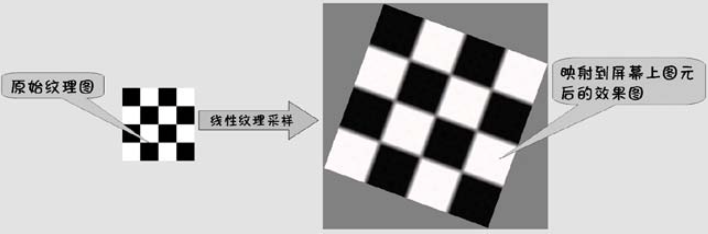

# 纹理采样

本文主要介绍了纹理相关的知识，以及提供了几个示例程序演示了某些涉及到的知识！

# 1、基本概念

## 1.1、什么是纹理？

纹理，也称为纹理贴图，就像是模型表面的皮肤，在没有光照计算的前提下为几何表面提供基础的色彩内容！纹理可以体现物体表面的性质，使物体看上去更加真实。


纹理贴图通常是一张二维的图片，纹理贴图将图像离散为一个个像素，称为纹素，纹素最终会映射到屏幕上。

那么如何将纹素映射到屏幕呢？需要告知渲染系统：为图元中的顶点指定恰当的纹理坐标！
* 纹理坐标又称 uv，是在纹理自身的单位纹理空间中定义的，是一个二维坐标，取值范围是 `[0, 1]` ;
* 确定了模型顶点的纹理坐标后，可以替换不同的纹理，而无需更改纹理坐标值；
* 单位化的纹理空间坐标最终通过变换映射到 `(0,0)~(width,height)` 的屏幕空间；
* Metal 中纹理空间的坐标系：原点在左上角；
* OpenGL中纹理空间的坐标系：原点在左下角；
* 不同纹理坐标系统的数据跨系统使用时，需要对数据做一次变换，否则可能会显示不正常；

纹理映射的基本思想：
* 首先为图元中的每个顶点指定恰当的纹理坐标；
* 然后通过纹理坐标在纹理贴图中确定可以选中的纹理区域；
* 最后将选中纹理区域中的内容根据纹理坐标映射到指定的图元上；

进行纹理映射的过程，实际就是为图元中的每个片元着色，用于着色的颜色需要从纹理贴图提取：
* 首先图元中的每个顶点都需要在顶点着色器中通过 out 变量，将纹理坐标传入片段着色器；
* 经过顶点着色器后，在光栅化阶段分会根据情况进行插值计算，产生对应每个片元的用于记录纹理坐标的 out 值；
* 最后每个片元在片段着色器中根据其接收到的纹理坐标，到纹理贴图中提出对应位置的颜色即可；__提取颜色的过程一般称之为纹理采样__；

> 在实际开发中，建议使用宽和高像素都为 `2^n` 纹理贴图，这样做有助于提高处理效率！

_注意_：在开发中如果不希望纹理映射后发生很大的变形，就需要尽量使构成图元的各顶点形成的几何形状与各顶点纹理坐标构成的几何形状类似！

## 1.2、纹理空间

在整个渲染流程中，几何顶点有标准的剪裁空间坐标系！而在纹理中，也有纹理坐标系！

对于 2D 纹理而言，归一化的纹理坐标取值范围是 `[0, 1]`；
* 纹理坐标点 `(0, 0)` 表示纹理中左上角的那个像素；
* 纹理坐标点 `(1, 1)` 表示纹理中右下角的那个像素！


## 1.3、纹理拉伸

一般而言，S 轴或者 T 轴的纹理坐标，都是设置在 `[0.0, 1.0]` 的范围内，这满足了大多数场景！但在某些场景下，也可以设置大于 1 或者小于 0 的纹理坐标，如下述代码设置的纹理坐标：

```
{
        /// 设置一个正方形的顶点数据
        VertexData quadVertices[6] = {
        ///    几何坐标          纹理坐标
        { {  250,  -250 },  { 5.0, 5.0 } },
        { { -250,  -250 },  {-5.0, 5.0 } },
        { { -250,   250 },  {-5.0,-3.0 } },

        { {  250,  -250 },  { 5.0, 5.0 } },
        { { -250,   250 },  {-5.0,-5.0 } },
        { {  250,   250 },  { 5.0,-5.0 } },
    };
}
```

针对超出纹理空间 `[0.0, 1.0]` 的坐标，有三种处理方案：重复拉伸、镜像重复拉伸、截取拉伸！Metal 通过为采样器设置不同的寻址模式，实现这些处理方案！

```

/// 当获取超出纹理边界时，决定每个像素上的纹理坐标的模式
typedef NS_ENUM(NSUInteger, MTLSamplerAddressMode) {
    /// 纹理坐标固定在 [0.0, 1.0]
    MTLSamplerAddressModeClampToEdge = 0,
    
    /// 纹理坐标固定在 [-1.0, 1.0] 镜像坐标
    MTLSamplerAddressModeMirrorClampToEdge = 1,
    
    MTLSamplerAddressModeRepeat = 2,       /// 重复拉伸    
    MTLSamplerAddressModeMirrorRepeat = 3, /// 镜像重复拉伸
    
    /// 超出范围的纹理坐标对于带有alpha通道的图像返回透明零(0,0,0,0)，对于没有alpha通道的图像返回不透明零(0,0,0,1)。
    MTLSamplerAddressModeClampToZero = 4,
    
    /// 超出范围的纹理坐标返回由borderColor属性指定的值。
    MTLSamplerAddressModeClampToBorderColor = 5,
};
```

纹理寻址解决的是纹理采样超出纹理边界时如何采样的问题。寻址模式有以下几种：
* `repeat`：repeat 寻址模式下超出纹理空间后，回到纹理坐标0重复采样。寻址坐标重复模式为：[0～1][0～1][0~1]...
* `mirrored_repeat`：镜像重复寻址，也是超出后重复寻址采样，只是重复模式为：[0~1][1~0][0~1]...
* `clamp_to_edge`：默认的寻址模式，指的是超出边界重复纹理边缘的像素；
* `clamp_to_zero`：指的是超出边界使用黑色或者透明颜色填充；
* `clamp_to_border`：指的是超出边界使用纹理边框颜色填充.

### 1.3.1、重复拉伸

若设置的拉伸方式为重复，当顶点纹理坐标大于 1 时，则实际起作用的纹理坐标的小数部分!

如纹理坐标为 3.3， 则起作用的纹理坐标为 0.3；此时会产生重复的效果，如下图所示：
* 纹理贴图分别在 S 轴与 T 轴都重复 10 次；


```
fragment float4 fragmentShader(YLShaderData in [[stage_in]],
                               texture2d<half> colorTexture[[texture(TextureInputLogo)]]) {
    constexpr sampler textureSampler(address::repeat); /// 设定采样器的寻址模式为重复采样
    const half4 colorSample = colorTexture.sample(textureSampler, in.textureCoordinate);
    return float4(colorSample);
}
```

重复拉伸在很多大场景地形的纹理贴图中很有用，如将大块地面重复铺满草皮纹理、将大片水片铺满水波纹理等。如果没有定义重复拉伸方式，开发人员只能将大块面积切割为一块一块小的矩形，对每一块矩形单独设置 `0.0 ~ 1.0` 的纹理坐标！这样开发不但繁琐，而且增加了顶点的数量，程序运行时的效率也会收到很大的影响。
因此，开发中要注意重复拉伸方式的灵活运用，可以使用重复拉伸方式时，就不要去无谓的增加顶点数量了！

### 1.3.2、镜像重复拉伸

若设置的拉伸方式为镜像重复拉伸，当顶点纹理坐标大于 1 时，则实际起作用的为 纹理坐标的小数部分！这种情况会产生镜像重复的效果，如下图所示：


```
fragment float4 fragmentShader(YLShaderData in [[stage_in]],
                               texture2d<half> colorTexture[[texture(TextureInputLogo)]]) {
    /// 设定采样器的寻址模式为镜像重复拉伸
    constexpr sampler textureSampler(address::mirrored_repeat);             
    const half4 colorSample = colorTexture.sample(textureSampler, in.textureCoordinate);
    return float4(colorSample);
}
```

### 1.3.3、截取拉伸

若设置的拉伸方式为截取拉伸，则将顶点纹理坐标大于 1 的都看作 1，此时会产生一种边缘被拉伸的效果。如下图所示，产生了纹理横向拉伸和纵向拉伸的效果


```
fragment float4 fragmentShader(YLShaderData in [[stage_in]],
                               texture2d<half> colorTexture[[texture(TextureInputLogo)]]) {
    /// 设定采样器的寻址模式为截取拉伸       
    constexpr sampler textureSampler(address::clamp_to_edge);           
    const half4 colorSample = colorTexture.sample(textureSampler, in.textureCoordinate);
    return float4(colorSample);
}
```

## 1.4、纹理采样

所谓纹理采样就是根据片元的纹理坐标到纹理中提取对应位置颜色的过程！

但由于图元中的片元数量与其对应纹理区域中的像素数量并不一定相同。也就是说，图元中的片元与纹理贴图中的像素并不总是一一对应的；例如，将较小的纹理贴图映射到较大的图元或者将较大的纹理贴图映射到较小的图元！
__通过纹理坐标在纹理贴图中并不一定能找到与之完全对应的像素__，这时候需要采用一些策略使得纹理采样可以顺利进行下去！通常采用的策略有__最近点采样__ 和 __线性采样__ 两种方案！

### 1.4.1、最近点采样

最近点采样是最简单的一种采样算法，其速度也是各种采样算法中最快的！


如上图所示：
* 纹理图的S轴和Y轴纹理坐标的范围都是 `[0, 1]`，而纹理图本身是由一个一个离散的像素组成的。
  若将每个像素看成一个小方块，则每个像素都占一定的纹理坐标范围。上图中左上侧的像素纹理坐标的范围为:S 方向 0.0~0.025，T 方向 0.0~0.025。
* 根据片元的纹理坐标可以很容易地计算出片元对应的纹理坐标点位于纹理图中的哪个像素(小方格)中，最近点采样就直接取此像素的颜色值为采样值。

从前面原理的介绍中可以看出，最近点采样很简单，计算量也小。但最近点采样也有一个明显的缺点，那就是若把较小的纹理图映射到较大的图元上时容易产生很明显的锯齿，如下图所示：


需要注意的是，将较大的纹理图映射到较小的图元时，也会有锯齿产生，但由于图元整体较小，视觉上就不那么明显了。

### 1.4.2、线性采样

从上一小节的介绍中可以看出，在某些情况下，最近点采样不能满足高视觉效果的要求，这时可以选用更复杂一些的线性纹理采样算法。


线性采样时的结果颜色并不一定仅来自于纹理图中的一个像素，其在采样时会考虑到片元对应的纹理坐标点附近的几个像素。如上图所示，右侧片元的纹理坐标对应的纹理点在纹理 图中的小黑点位置，此时可以认为纹理点位于采样范围的中央。因此，采样范围涉及了 4 个像素，但由于纹理点并没有位于 4 个像素的交叉点上，从而 4 个像素的颜色在结果中所占的比例也不尽相同。

一般是根据涉及的像素在采样范围内的面积比例加权计算出最终的采样结果，但具体采样时使用的采样范围可能因厂商的不同而有所不同，上图中的采样范围只是对原理的说明。

由于采样时对采样范围内的多个像素进行了加权平均，因此，在将较小的纹理图映射到较大的图元上时，不再会有锯齿的现象，而是平滑过度的，如下图所示：



平滑过度解决了锯齿问题，但有时线条边缘会很模糊，因此，实际开发中采 用哪种采样策略，需要根据具体的需求来确定。

### 1.4.3、MIN 与 MAG 采样

> 当纹理图中的一个像素对应到待映射图元上的多个片元时，采用 MAG 采样；反之则采用 MIN 采样。


* 当纹理图比需要映射的图元尺寸大时系统采用 MIN 对应的纹理采样算法设置
* 当纹理图比需要映射的图元尺寸小时系统采用 MAG 对应的纹理采样算法设置

由于最近点采样计算速度快，在 MIN 情况下一般锯齿也不明显，综合效率高; 而 MAG 方式下若采用最近点采样则锯齿会很明显，严重影响视觉效果。因此，实际 开发中，一般情况下往往采用将 MIN 情况设置为最近点采样，将 MAG 情况设置为线性采样的组合。

### 1.4.4、Metal 中的采样对象

在 Metal 中，采样器负责纹理的采样，包括控制纹理采样期间一些插值细节操作！
可以根据采样描述符配置一个采样对象，也可以直接在片段着色器中创建一个简易的采样器 ：

```
/// 直接在着色器中创建一个简易的采样器
fragment float4 fragmentShader(YLShaderData in [[stage_in]],
                                      texture2d<half> colorTexture[[texture(ShaderParamTypeTextureOutput)]]) {     
    constexpr sampler textureSampler(mag_filter::linear,   /// mag 线性点采样
                                     min_filter::nearest,  /// min 最近点采样
                                        address::nearest); /// 寻址策略为重复拉伸
    const half4 colorSample = colorTexture.sample(textureSampler, in.textureCoordinate);
    return float4(colorSample);
}
```

如果在同一个程序中有很多纹理使用的话，大量的相同操作会重复进行，效率不高。此时可以使用采样描述符配置一个全局的采样对象，提高效率！

```
MTLSamplerDescriptor *samplerDes = [[MTLSamplerDescriptor alloc] init];
samplerDes.magFilter = MTLSamplerMinMagFilterLinear;   /// mag 线性点采样
samplerDes.minFilter = MTLSamplerMinMagFilterNearest;  /// min 最近点采样
samplerDes.rAddressMode = MTLSamplerAddressModeRepeat; /// 寻址策略为重复拉伸
samplerDes.sAddressMode = MTLSamplerAddressModeRepeat;
id<MTLSamplerState> sampler = [_device newSamplerStateWithDescriptor:samplerDes];
```

通过配置一个全局的采样器，可以将特定的纹理拉伸方式和采样方式设置信息进行组合，重用于不同的纹理、以提高效率！

## 1.5、Mipmap 纹理技术

当需要处理的场景很大时(如一大片铺满相同纹理的丘陵地面)，若不采用一些技术手段，可能会出现远处地形上视觉更清楚，近处地形上更模糊的__反真实现象__。

这主要是由透视投影中的近大远小的效果，远处的地形投影到屏幕上的尺寸比较小，近处的尺寸比较大，而整个场景使用的是同一幅纹理图！因此对远处的山体而言纹理图被缩小进行映射，自然很清楚；而近处的山体可能纹理图需要被拉大进行映射，自然就发虚。

此时，应该对远处的地形采用尺寸较小分辨率低的纹理，近处的采用尺寸较大分辨率高的纹理，这就是 `mipmap` 的基本思想！

`mipmap` 仅需要在加载纹理文件时进行一些设置即可，其它的工作是由渲染管道自动完成的，基本工作原理如下所示：


开发人员仅需提供一幅原始纹理图，系统会在纹理加载时自动生成一系列由大到小的纹理。每幅纹理图是前一幅尺寸的 1/2 ，直至纹理图的尺寸缩小到 1x1 。一系列纹理图中的第一幅就是原始纹理图，由此可以轻松地计算出，一系列的 `mipmap` 纹理图占用的内存空间接近原始纹理图的 2 倍！一系列的 `mipmap` 纹理图生成后，当应用程序运行时，渲染管道会首先根据情况计算出细节级别，然后根据细节级别决定使用系列中的哪一个分辨率纹理图。

在 Metal 开发中通过配置 `MTLTextureDescriptor` 来开启 `mipmap`，并设定 `mipmap` 贴图数量：

```
{
    /// 配置 MTLTextureDescriptor 来开启 mipmap
    MTLTextureDescriptor *textureDescriptor = [MTLTextureDescriptor texture2DDescriptorWithPixelFormat:MTLPixelFormatBGRA8Unorm width: image.width height: image.height mipmapped:YES];
    
    /// 指定生成Mip贴图的数量，若 mipmapped=NO 则默认mipmapLevelCount=1，表示不生成MipMap
    textureDescriptor.mipmapLevelCount = 3;
    textureDescriptor.textureType = MTLTextureType2D;
    textureDescriptor.usage = MTLTextureUsageShaderRead;
    id<MTLTexture> texture = [_device newTextureWithDescriptor:textureDescriptor];    
}
```


下述代码使用三线性滤波[代码如下](https://developer.apple.com/documentation/metal/textures/improving_filtering_quality_and_sampling_performance/adding_mipmap_filtering_to_samplers?language=objc)：

```
{
    /// min、mag、mip 都使用线性滤波！这种组合通常称之为 三线性滤波
    MTLSamplerDescriptor *descriptor = [MTLSamplerDescriptor new];
    descriptor.minFilter = MTLSamplerMinMagFilterLinear;
    descriptor.magFilter = MTLSamplerMinMagFilterLinear;
    descriptor.mipFilter = MTLSamplerMipFilterLinear;
    /// 在三线性滤波下：GPU 选择两个大小最接近的 mipmap，并通过从每个 mipmap中 线性过滤四个像素来生成一个样本。
    /// 然后将这两个值与线性插值混合，生成最终的样本。
    id<MTLSamplerState> sampler = [_device newSamplerStateWithDescriptor: descriptor];
}
```

也可以设置采样为最近点采样，而非线性采样！这样做，虽然可以减少采样的像素数量，但会获得低质量的纹理贴图！

```
/// 在片段着色器设置采样格式
fragment float4 fragmentShader(YLShaderData in [[stage_in]],
                                      texture2d<half> colorTexture[[texture(ShaderParamTypeTextureOutput)]]) {
    constexpr sampler textureSampler(mag_filter::linear,  /// mag 线性点采样
                                     min_filter::nearest, /// min 最近点采样
                                     mip_filter::nearest);
    const half4 colorSample = colorTexture.sample(textureSampler, in.textureCoordinate);
    return float4(colorSample);
}
```

因此需要在采样性能和画面质量之间做出权衡！

```
typedef enum MTLSamplerMipFilter : NSUInteger {
    MTLSamplerMipFilterNotMipmapped = 0, /// 不使用 Mip 技术    
    MTLSamplerMipFilterNearest = 1,      /// 在 MIP 层使用最近点采样
    MTLSamplerMipFilterLinear = 2,       /// 在 MIP 层采用线性采样 
    /// 如果过滤器落在mipmap级别之间，则对两个级别进行采样，结果由级别之间的线性插值确定
} MTLSamplerMipFilter;
```

三线性滤波的支持取决于 GPU 和纹理采样的格式：
* 例如，不能对整数格式的纹理使用线性过滤；
* 只有一些 GPU 支持对浮点格式的纹理进行线性过滤；


## 1.6、多重纹理与过程纹理

在之前的学习中，对同一图元只采用了一幅纹理图，这在某些场景就显得不够真实。如地月系统的运行效果：
* 在阳光照耀到的区域使用白天的纹理；
* 在阳光没有照耀到的区域，使用夜晚万家灯火的纹理；
* 在白天与黑夜之间的边缘部分，是平滑过渡的；

> 对同一图元采用多幅纹理图，这种技术称之为多重纹理！
> 在多重纹理变化的边界根据某种规则进行平滑过渡，这种技术称之为过程纹理！

平滑过渡在很多场景中都会用到，如白天纹理与黑夜纹理的过渡，丘陵地形中根据海拔不同进行的纹理过渡等！

# 2、示例·纹理采样

[示例](https://github.com/Kanthine/MetalCode/tree/main/SamplingTexture) 演示了 Metal 的纹理采样过程。

在 Metal 中，纹理由 `MTLTexture` 对象来管理；`MTLTexture` 定义了纹理信息，包括像素格式、纹理宽高等！纹理 `MTLTexture` 一旦创建，其像素格式、纹理宽高等都不能再改变，但可以改变像素数据。

使用 [MTKTextureLoader](https://developer.apple.com/documentation/metalkit/mtktextureloader) 来执行简单的纹理加载。该对象是MetalKit框架中的一个将普通图片加载解码为MTLTexture的对象，将普通的JPG、PNG、TIFF等格式的图片数据加载到MTLTexture对象中供在Metal中使用。

```
MTKTextureLoader *loader = [[MTKTextureLoader alloc] initWithDevice: device];
id<MTLTexture> texture = [loader newTextureWithContentsOfURL:url options:nil error:nil];
if(!texture)
{
    NSLog(@"Failed to create the texture from %@", url.absoluteString);
    return nil;
}
```


``` objective-c
{
    NSError *error = NULL;
    MTKTextureLoader *textureLoader = [[MTKTextureLoader alloc] initWithDevice:_device];
    NSDictionary *textureLoaderOptions = @{MTKTextureLoaderOptionTextureUsage:@(MTLTextureUsageShaderRead),
                                           MTKTextureLoaderOptionTextureStorageMode:@(MTLStorageModePrivate)};
                                           
    /// 创建一个纹理
    _texture = [textureLoader newTextureWithName:@"image" scaleFactor:1.0
                                           bundle:nil options:textureLoaderOptions
                                            error:&error];
    NSAssert(_texture, @"Could not load texture: %@", error);
}

```

## 纹理映射到几何图元

从渲染流程上看，不能直接渲染纹理；
* 首先渲染一个 2D 或者 3D 的几何图形；
* 接着将纹理中的每个像素映射到几何图形表面上的对应点，获取纹理坐标；
* 在片段着色器不再使用指定的颜色值，而是根据纹理坐标，对纹理采样，得到纹理的色值；


对于 2D 纹理而言，归一化的纹理坐标取值范围是 `[0, 1]`；
* 纹理坐标点 `(0, 0)` 表示纹理中左上角的那个像素；
* 纹理坐标点 `(1, 1)` 表示纹理中右下角的那个像素！


在顶点数据中，四边形的四个顶点分别映射到对应的纹理坐标点！
* 虽然仅提供了四边形的四个纹理坐标，但在光栅化阶段，为四个顶点之间的每个点插值时，会为纹理坐标进行平滑插值！

``` objective-c
static const AAPLVertex quadVertices[] = {
    ///    几何坐标         纹理坐标
    { {  250,  -250 },  { 1.f, 1.f } },
    { { -250,  -250 },  { 0.f, 1.f } },
    { { -250,   250 },  { 0.f, 0.f } },

    { {  250,  -250 },  { 1.f, 1.f } },
    { { -250,   250 },  { 0.f, 0.f } },
    { {  250,   250 },  { 1.f, 0.f } },
};
```

渲染管线的数据传递，除了剪裁空间的几何坐标；还需要新增一个纹理坐标，在片段着色器中使用！

``` metal
struct RasterizerData {
    float4 position [[position]]; /// 剪裁空间的坐标
    float2 textureCoordinate;     /// 纹理坐标，在光栅化阶段被平滑的插值
};
```

在应用层为四边形指定的纹理坐标，需要通过顶点着色器传入渲染管线！

``` metal
vertex RasterizerData
vertexShader(uint vertexID [[ vertex_id ]],
             constant AAPLVertex     *vertexArray  [[ buffer(VertexInputIndexVertices) ]],
             constant vector_float2 &viewportSize  [[ buffer(VertexInputIndexViewportSize) ]]) {
    float2 position = vertexArray[vertexID].position.xy / viewportSize * 2.0;
    
    RasterizerData out;
    out.position = vector_float4(position, 0.0, 1.0);
    
    /// 在顶点着色器中，将纹理坐标传出去
    out.textureCoordinate = vertexArray[vertexID].textureCoordinate;
    return out;
}
```

## 对纹理采样

片段着色器主要工作：根据传入的纹理坐标对指定纹理进行采样，为片元提供一个色值！
* 使用属性限定符 `[[texture]]` 表明这是从应用层传入的纹理类型 `MTLTexture`!

``` metal
fragment float4
samplingShader(RasterizerData in [[stage_in]],
               texture2d<half> colorTexture [[texture(TextureIndexBaseColor)]]) {
               
    /// 创建一个采样器
    constexpr sampler textureSampler (mag_filter::linear, min_filter::linear);
    
    /// 使用采样器获取纹理上指定坐标的像素色值
    const half4 colorSample = colorTexture.sample(textureSampler, in.textureCoordinate);
    return float4(colorSample);
}

```

当被渲染的区域与纹理大小不同时，采样器可以使用不同的算法来计算' sample() '函数应该返回的texel颜色。
设置' mag_filter '模式来指定当面积大于纹理大小时采样器应该如何计算返回的颜色，设置' min_filter '模式来指定当面积小于纹理大小时采样器应该如何计算返回的颜色。
为两个滤波器设置“线性”模式，使采样器平均给定纹理坐标周围的像素的颜色，从而产生更平滑的输出图像。

When the area being rendered to isn't the same size as the texture, the sampler can use different algorithms to calculate exactly what texel color the `sample()` function should return.
Set the `mag_filter` mode to specify how the sampler should calculate the returned color when the area is larger than the size of the texture, and the `min_filter` mode to specify how the sampler should calculate the returned color when the area is smaller than the size of the texture.
Setting a `linear` mode for both filters makes the sampler average the color of pixels surrounding the given texture coordinate, resulting in a smoother output image.


-注意:尝试增加或减少大小的quad，看看如何过滤工作。
- Note: Try increasing or decreasing the size of the quad to see how filtering works.

## 编码绘制参数

``` objective-c
/// 为片段着色器添加一个参数：待采样的纹理
[renderEncoder setFragmentTexture:_texture
                          atIndex:TextureIndexBaseColor];
```


# 3、示例·读取纹理中的像素数据
 
Metal 对纹理渲染做了很多优化，可以让 GPU 快速访问，但不允许 CPU 直接访问纹理数据！
当我们需要改变或读取纹理数据时，可以使用 Metal 分配共享缓冲区，GPU 将纹理数据复制到共享缓存，CPU 从共享缓存访问纹理数据。

[Demo](https://docs-assets.developer.apple.com/published/e309a9c3d3/ReadingPixelDataFromADrawableTexture.zip) 主要演示：
* 单击单个点或者拖出一个矩形来读取存储在该区域的像素数据，并保存到本地；
* 将物体坐标转换到裁剪空间坐标；

## 为读取权限配置可绘制纹理

默认情况下，MetalKit 视图创建可绘制纹理仅用于渲染，所以其他 Metal 命令不能访问纹理。
* 然而当用户选择演示视图的一部分时，我们需要获得该区域的纹理数据！
* 通过配置 `allowsNextDrawableTimeout = NO` 使得 `CAMetalLayer` 无限期地等待新的绘制。
* 以达到读取纹理的目的！

``` 
_view.framebufferOnly = NO;
((CAMetalLayer*)_view.layer).allowsNextDrawableTimeout = NO;
_view.colorPixelFormat = MTLPixelFormatBGRA8Unorm;
```

__注意__：
* 通过上述设置，可能会牺牲 Metal 的一些优化，导致渲染性能的下降；
* 因此除非必要，不要轻易更改渲染配置；


## 确定拷贝哪些像素

通过与用户交互，确定待拷贝区域，然后将该区域的视图坐标转为 Metal 的纹理坐标。
* 由于图形坐标系统和 API 的不同，在视图坐标和纹理坐标之间转换的代码因平台而异；
* 在macOS中，调用 `-pointToBacking:` 方法将一个位置转换为支持存储中的像素位置，然后应用坐标转换来调整原点和 Y 轴；

``` 
CGPoint bottomUpPixelPosition = [_view convertPointToBacking:event.locationInWindow];
CGPoint topDownPixelPosition = CGPointMake(bottomUpPixelPosition.x,
                                           _view.drawableSize.height - bottomUpPixelPosition.y);
```

* 在iOS中，读取视图的 `contentScaleFactor`，并对视图坐标进行缩放变换；
* iOS 视图坐标和 Metal 纹理坐标相同，所以无需转换坐标系；

``` 
- (CGPoint)pointToBacking:(CGPoint)point {
    CGFloat scale = _view.contentScaleFactor;
    CGPoint pixel;

    pixel.x = point.x * scale;
    pixel.y = point.y * scale;

    // 将像素值四舍五入，然后放在一个网格上
    pixel.x = (int64_t)pixel.x;
    pixel.y = (int64_t)pixel.y;

    // 移动到像素中心
    pixel.x += 0.5f;
    pixel.y += 0.5f;

    return pixel;
}
```


## 渲染像素数据

当用户在视图中选择一个区域时，视图控制器调用 `-renderAndReadPixelsFromView:withRegion` 方法来渲染绘制的内容，并将它们复制到 Metal 缓冲区。

这创建了一个新的命令缓冲区，并调用一个方法来编码渲染管道！

该 Demo 并不关注具体的渲染图像！


``` 

id<MTLCommandBuffer> commandBuffer = [_commandQueue commandBuffer];

/// 编码渲染管道，将图像渲染到 drawable 纹理
[self drawScene:view withCommandBuffer:commandBuffer];

```

在对渲染管道编码后，调用另一个方法来对命令进行编码，以复制渲染纹理的某一部分。

程序选择在渲染 drawable 纹理之前拷贝像素数据，因为系统会在渲染纹理之后丢弃纹理的内容。


``` 
id<MTLTexture> readTexture = view.currentDrawable.texture;

MTLOrigin readOrigin = MTLOriginMake(region.origin.x, region.origin.y, 0);
MTLSize readSize = MTLSizeMake(region.size.width, region.size.height, 1);

const id<MTLBuffer> pixelBuffer = [self readPixelsWithCommandBuffer:commandBuffer
                                                        fromTexture:readTexture
                                                           atOrigin:readOrigin
                                                           withSize:readSize];
```


## 拷贝像素数据到缓冲区

封装了一个编码拷贝纹理命令的方法，将相同的命令缓冲区传给此方法，所以Metal在渲染之后编码这些新命令。

Metal 自动管理对目标纹理的依赖关系，并确保在拷贝纹理数据之前完成渲染。

* 首先，分配一个 Metal 缓冲区来保存像素数据；
* 计算缓冲区的大小：一个像素的字节大小乘以区域的宽度和高度；
* 类似地，计算每行的字节数，这是拷贝数据时所需要的；
* 该示例没有在行尾添加任何填充；
* 然后创建新的 Metal 缓冲区，指定共享存储模式，以便 CUPU 可以读取缓冲区的内容。

``` 
NSUInteger bytesPerPixel = sizeofPixelFormat(texture.pixelFormat); /// 一个像素的字节大小
NSUInteger bytesPerRow   = size.width * bytesPerPixel;             /// 每行的字节数
NSUInteger bytesPerImage = size.height * bytesPerRow;              /// 计算总字节数

_readBuffer = [texture.device newBufferWithLength:bytesPerImage options:MTLResourceStorageModeShared];
```

* 接着创建 [`MTLBlitCommandEncoder`](https://developer.apple.com/documentation/metal/mtlblitcommandencoder), 它提供在 Metal 资源之间复制数据、用数据填充资源以及执行其他类似的与资源相关的任务，这些任务不直接涉及计算或渲染。
* 程序编码一个 `blit` 命令，将纹理数据拷贝到新缓冲区的开头。
* 然后结束 `blit` 通道；

``` 
id <MTLBlitCommandEncoder> blitEncoder = [commandBuffer blitCommandEncoder];

[blitEncoder copyFromTexture:texture
                 sourceSlice:0
                 sourceLevel:0
                sourceOrigin:origin
                  sourceSize:size
                    toBuffer:_readBuffer
           destinationOffset:0
      destinationBytesPerRow:bytesPerRow
    destinationBytesPerImage:bytesPerImage];

[blitEncoder endEncoding];

```

* 最后提交命令缓冲区并调用 `-waitUntilCompleted` 来同步等待 GPU 完成渲染和 `blit` 命令;
* 调用方法之后，缓冲区将包含所请求的像素数据；
* 同步命令降低了CPU和GPU之间的并行性，在实际开发中建议使用异步命令；


```
[commandBuffer commit];

// 同步等待GPU完成blit传递，才能从_readBuffer读取数据。
[commandBuffer waitUntilCompleted];
```
