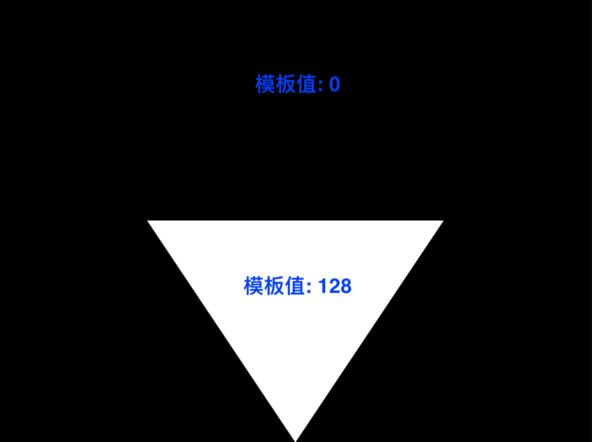

# 模板测试

帧缓冲区作为渲染管线绘制结果存储的逻辑对象，包含颜色缓冲区、深度缓冲区、模板缓冲区：
* 颜色缓冲区存储渲染结果的 RGBA 信息；
* 深度缓冲区，可以采用纹理图、也可以通过渲染管线来实现；
* 模板缓冲区，只能通过渲染管线来实现！

什么是模板测试呢？就像对缕空纸板喷漆一样，当启用模板测试时，通过模板测试的片元会被替换到颜色缓冲区中、从而显示出来，未通过测试的片段被丢弃、不能保存到颜色缓冲区，达到蒙版效果！

在本文，主要叙述如何实现一个简单的[模板测试](https://github.com/Kanthine/MetalCode/tree/main/StencilTest)!

```
{
    /// 首先设置深度与模板测试的缓冲区数据格式
    /// 深度和模板结果使用 40 位组合格式：深度为32位浮点值，模板为8位无符号整数
    mtkView.depthStencilPixelFormat = MTLPixelFormatDepth32Float_Stencil8;
}
```

# 1、绘制模板

实现一个镂空效果，首先需要制作模板！
* 模板测试‘蒙版的缕空与遮罩’正好相反于镂空喷漆的‘镂空区域与遮罩’！这句话可能有点绕，下面通过代码与效果图慢慢理解！

## 1.1、模板·渲染管线

相比于深度测试的简单配置，使用模板测试还需要创建一个用于渲染模板的渲染管线！该渲染管线无需实现片段着色器，仅通过顶点着色器、绘制一个几何蒙版即可！

```
{
    id<MTLLibrary> defaultLibrary = [mtkView.device newDefaultLibrary];
    MTLRenderPipelineDescriptor *pipelineStateDescriptor = [[MTLRenderPipelineDescriptor alloc] init];
    pipelineStateDescriptor.label = @"蒙版·管道管线";
    pipelineStateDescriptor.vertexFunction = [defaultLibrary newFunctionWithName:@"vertexShader"];
    pipelineStateDescriptor.colorAttachments[0].pixelFormat = mtkView.colorPixelFormat;
    pipelineStateDescriptor.depthAttachmentPixelFormat = mtkView.depthStencilPixelFormat;
    pipelineStateDescriptor.stencilAttachmentPixelFormat = mtkView.depthStencilPixelFormat;
    NSError *error;
    _maskPipelineState = [mtkView.device newRenderPipelineStateWithDescriptor:pipelineStateDescriptor error:&error];
    NSAssert(_maskPipelineState, @"Failed to create pipeline state: %@", error);
}
```

## 1.2、模板测试

类似于深度测试，模板测试也需要一个对象来管理其行为，比如测试通过、测试失败时的行为！模板缓冲区的值与模板参考值，是保留原值、还是使用参考值替代缓冲区的原值！

在深度模板 `MTLDepthStencilDescriptor` 中，Metal 首先进行模板测试，接着进行深度测试，最后决定测试结果。如果没有深度测试，则不用考虑深度测试的结果！
* 模板值比较策略 `MTLCompareFunctionAlways`：即总是通过比较，制作模板时需要该策略；
* 模板测试失败后 `MTLStencilOperationKeep` ：保持模板缓冲区的原有值；
* 模板测试通过后 `MTLStencilOperationReplace`：拿参考值更新模板缓冲区的原有值；

```
{
    /// 设置模板测试行为
    MTLStencilDescriptor *stencilStateDesc = [MTLStencilDescriptor new];
    stencilStateDesc.stencilCompareFunction  = MTLCompareFunctionAlways; /// 新值总是通过测试
    stencilStateDesc.stencilFailureOperation = MTLStencilOperationKeep;  /// 保持模板缓冲区的原有值
    
    /// 关闭了深度测试，所以深度测试的结果直接跳过，可以不设置深度测试失败的行为
    /// stencilStateDesc.depthFailureOperation = MTLStencilOperationIncrementClamp;
    
    //// 深度测试通过，在此处可以理解为模板测试通过
    stencilStateDesc.depthStencilPassOperation = MTLStencilOperationReplace; /// 拿参考值更新模板缓冲区的原有值
    
    MTLDepthStencilDescriptor *depthStencilDesc = [MTLDepthStencilDescriptor new];
    depthStencilDesc.label = @"蒙版·测试";
    depthStencilDesc.depthWriteEnabled = NO; /// 关闭深度测试
    depthStencilDesc.frontFaceStencil = stencilStateDesc; /// 设置模板测试
    depthStencilDesc.backFaceStencil = stencilStateDesc;
    _maskStencilState = [mtkView.device newDepthStencilStateWithDescriptor:depthStencilDesc];
}
```

## 1.3、绘制模板

在渲染视图时，使用模板·渲染管线绘制一张‘镂空’的模板！

```
- (void)drawInMTKView:(nonnull MTKView *)view  {

    ...
    /*********** 1、制作蒙版 ************/
    vector_float2 vertices[3] = {
        simd_make_float2(      viewportSize.x / 4.0, viewportSize.y / 2.0),
        simd_make_float2(3.0 * viewportSize.x / 4.0, viewportSize.y / 2.0),
        simd_make_float2(      viewportSize.x / 2.0, viewportSize.y),
    };
    
    [renderEncoder setRenderPipelineState:_maskPipelineState]; /// 设置渲染管线
    [renderEncoder setStencilReferenceValue:128];              /// 设置模板值
    [renderEncoder setDepthStencilState:_maskStencilState];    /// 设置模板测试对象
    [renderEncoder setVertexBytes:&viewportSize length:sizeof(viewportSize) atIndex:VertexInputIndexViewport];
    [renderEncoder setVertexBytes:vertices length:sizeof(vertices) atIndex:VertexInputIndexVertices];
    [renderEncoder drawPrimitives:MTLPrimitiveTypeTriangle vertexStart:0 vertexCount:3];
    ...
    
    /*********** 2、使用蒙版 ************/
}
```

如下图所示，绘制到帧缓冲区的模板缓冲区：
* 白色三角形，是最终期望的镂空区域，其模板测试总时通过，因此模板值为 128；
* 黑色部分没有被涉及，模板值默认为 0；



# 2、使用模板实现镂空效果

在前文中，我们已经绘制了一张蒙版，现在可以使用这张蒙版来实现镂空效果！

## 2.1、图形渲染管线

在使用蒙版时，在渲染管线还需要做一些相关配置！

```
{
    id<MTLLibrary> defaultLibrary = [_device newDefaultLibrary];
    id<MTLFunction> vertexFunction = [defaultLibrary newFunctionWithName:@"vertexShader"];
    id<MTLFunction> fragmentFunction = [defaultLibrary newFunctionWithName:@"fragmentShader"];
    MTLRenderPipelineDescriptor *pipelineStateDescriptor = [[MTLRenderPipelineDescriptor alloc] init];
    pipelineStateDescriptor.label = @"渲染管道";
    pipelineStateDescriptor.vertexFunction = vertexFunction;
    pipelineStateDescriptor.fragmentFunction = fragmentFunction;
    pipelineStateDescriptor.colorAttachments[0].pixelFormat = mtkView.colorPixelFormat;
    /// 深度测试的数据格式
    pipelineStateDescriptor.depthAttachmentPixelFormat = mtkView.depthStencilPixelFormat;
    /// 模板测试的数据格式
    pipelineStateDescriptor.stencilAttachmentPixelFormat = mtkView.depthStencilPixelFormat;
    NSError *error;
    _pipelineState = [_device newRenderPipelineStateWithDescriptor:pipelineStateDescriptor error:&error];
}
```

## 2.2、模板对象

在前文，已经使用一个模板对象来创建了蒙版！现在，还需要创建一个模板对象来管理渲染管线如何对待这张蒙版！
* 模板比较策略为 `MTLCompareFunctionGreater`：如果新值大于现有值，则通过模板测试；
* 模板测试失败后 `MTLStencilOperationKeep`  ：保持模板缓冲区的原有值；
* 模板测试通过后 `MTLStencilOperationReplace`：仍然保持模板缓冲区的原有值（保持蒙版不被改变）

```
{
    MTLStencilDescriptor *stencilStateDesc = [MTLStencilDescriptor new];
    /// 比较策略：拿 ReferenceValue 参考值和当前像素缓存上的值进行比较
    stencilStateDesc.stencilCompareFunction = MTLCompareFunctionGreater;  /// 新值大于现有值，则通过测试
    stencilStateDesc.stencilFailureOperation = MTLStencilOperationKeep;   /// 模板测试失败·保持模板缓冲区的原有值
    stencilStateDesc.depthStencilPassOperation = MTLStencilOperationKeep; /// 保持模板缓冲区的原有值
    
    MTLDepthStencilDescriptor *depthStencilDesc = [MTLDepthStencilDescriptor new];
    depthStencilDesc.label = @"渲染·深度模板测试";
    depthStencilDesc.depthWriteEnabled = NO; /// 关闭深度测试
    depthStencilDesc.frontFaceStencil = stencilStateDesc;
    depthStencilDesc.backFaceStencil = stencilStateDesc;
    
    _stencilState = [_device newDepthStencilStateWithDescriptor:depthStencilDesc];
}
```

## 2.3、图形绘制

```
- (void)drawInMTKView:(nonnull MTKView *)view  {

    /*********** 1、制作蒙版 ************/
    ...
    
    /*********** 2、使用蒙版 ************/
        vector_float2 vertices[3] = {
        simd_make_float2(_viewportSize.x / 2.0,               0),
        simd_make_float2(                    0, _viewportSize.y),
        simd_make_float2(      _viewportSize.x, _viewportSize.y),
    };
    
    [renderEncoder setRenderPipelineState:_pipelineState];  /// 设置渲染对象
    [renderEncoder setStencilReferenceValue:64];            /// 设置蒙版值
    [renderEncoder setDepthStencilState:_stencilState];     /// 设置蒙版测试
    [renderEncoder setVertexBytes:&_viewportSize length:sizeof(_viewportSize) atIndex:VertexInputIndexViewport];
    [renderEncoder setVertexBytes:vertices length:sizeof(vertices) atIndex:VertexInputIndexVertices];
    [renderEncoder drawPrimitives:MTLPrimitiveTypeTriangle vertexStart:0 vertexCount:3];
}
```

回顾一下两条渲染管线涉及到的模板值：
* 第一条渲染管线执行之后：镂空区域模板值是 128，其余区域模板值默认为 0；
* 第二条渲染管线执行：渲染绘制图形的所有片元模板值均为 64；
    * 所有片元都会拿参考值 64 与模板缓冲区的值比较；
    * 镂空区域的模板缓冲区值为 128，模板测试失败，该片元被遮挡；
    * 其余区域的模板缓冲区值为 0，模板测试通过，片元可以显示；

其最终渲染效果图如下图所示：


# 3、模版测试 API

模板测试 [MTLStencilDescriptor](https://developer.apple.com/documentation/metal/mtlstencildescriptor?language=objc) 是一个很实用的功能，可以做出很多有意思的效果！

```
/// 参考值由 [MTLRenderCommandEncoder -setStencilReferenceValue:] 设置
/// 参考值与 模板/深度 缓冲区的原有值比较策略
typedef NS_ENUM(NSUInteger, MTLCompareFunction) {
    MTLCompareFunctionNever = 0,        /// 新值从不通过测试
    MTLCompareFunctionLess = 1,         /// 新值小于现有值，则通过测试
    MTLCompareFunctionEqual = 2,        /// 新值等于现有值，则通过测试
    MTLCompareFunctionLessEqual = 3,    /// 新值小于或等于现有值，则通过测试
    MTLCompareFunctionGreater = 4,      /// 新值大于现有值，则通过测试
    MTLCompareFunctionNotEqual = 5,     /// 新值不等于现有值，则通过测试
    MTLCompareFunctionGreaterEqual = 6, /// 新值大于或等于现有值，则通过测试
    MTLCompareFunctionAlways = 7,       /// 新值总是通过测试
} API_AVAILABLE(macos(10.11), ios(8.0));


typedef NS_ENUM(NSUInteger, MTLStencilOperation) {
    MTLStencilOperationKeep = 0,           /// 保持缓冲区的原有值
    MTLStencilOperationZero = 1,           /// 将模板值设置为零    
    MTLStencilOperationReplace = 2,        /// 替换：拿参考值替代缓冲区的原有值
    MTLStencilOperationIncrementClamp = 3, /// 当前缓冲区的值增加1，但不溢出，如果到255，就不再加
    MTLStencilOperationDecrementClamp = 4, /// 当前缓冲区的值减少1，但不溢出，值到0就不再减
    MTLStencilOperationInvert = 5,         /// 按位取反，如果1就会变成254
    MTLStencilOperationIncrementWrap = 6,  /// 值增加1，会溢出，所以255变成0
    MTLStencilOperationDecrementWrap = 7,  /// 值减少1，会溢出，所以0变成255
};

@interface MTLStencilDescriptor : NSObject <NSCopying>

/// 比较策略：拿 ReferenceValue 参考值和当前像素缓存上的值进行比较
@property (nonatomic) MTLCompareFunction stencilCompareFunction;

/// 第一步：模版测试，测试失败时的操作
@property (nonatomic) MTLStencilOperation stencilFailureOperation;

/// 第二步：模版测试通过，做深度测试，深度测试失败时的操作
@property (nonatomic) MTLStencilOperation depthFailureOperation;

/// 第三步：模版测试、深度测试都通过，接下来的操作
@property (nonatomic) MTLStencilOperation depthStencilPassOperation;

/// 对当前模板值和参考值进行 & 操作，默认值 1，一般不用
@property (nonatomic) uint32_t readMask;

/// 写入Mask操作，默认值 0 ，一般不用
@property (nonatomic) uint32_t writeMask;

@end
```
