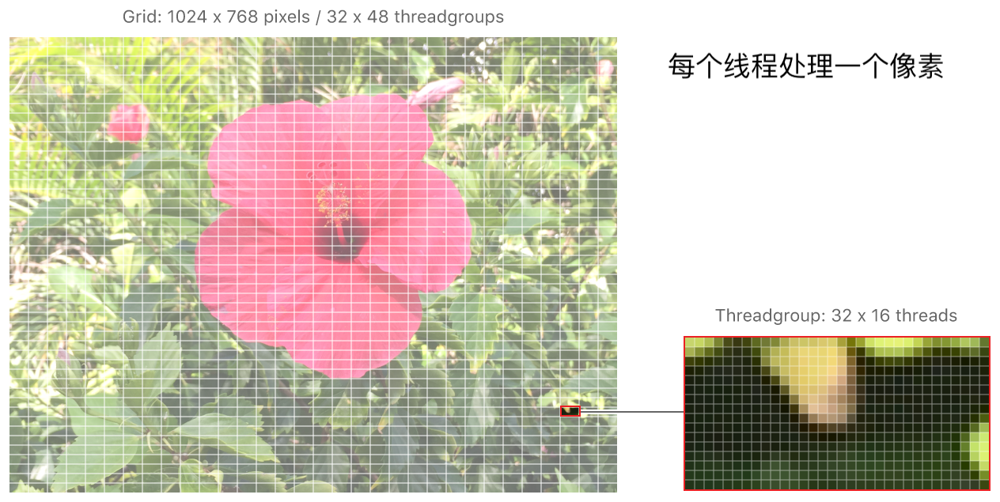
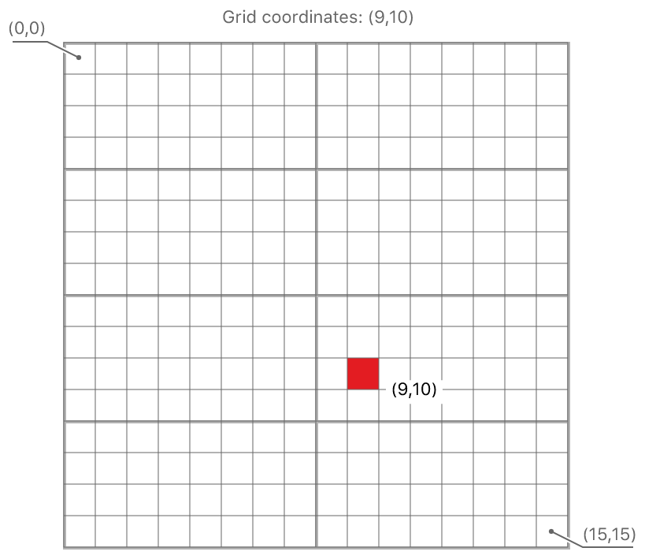
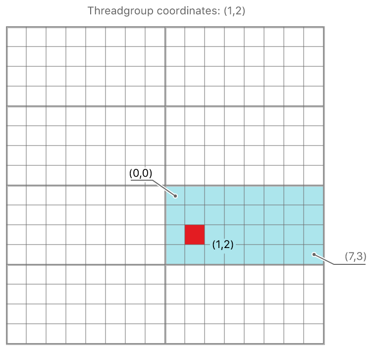
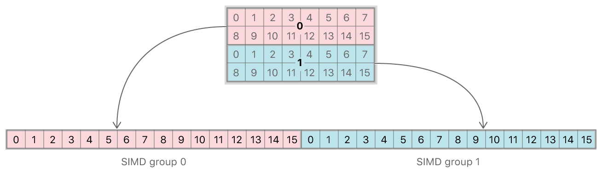
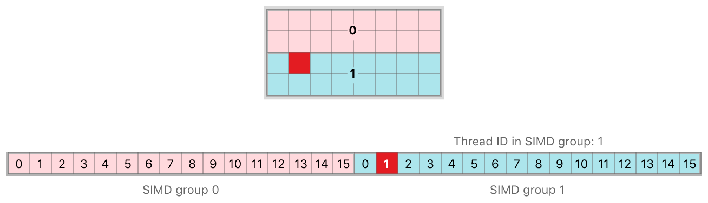
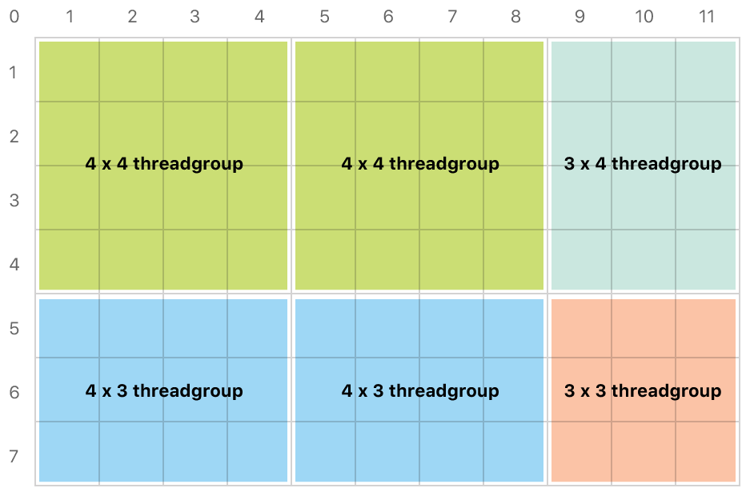
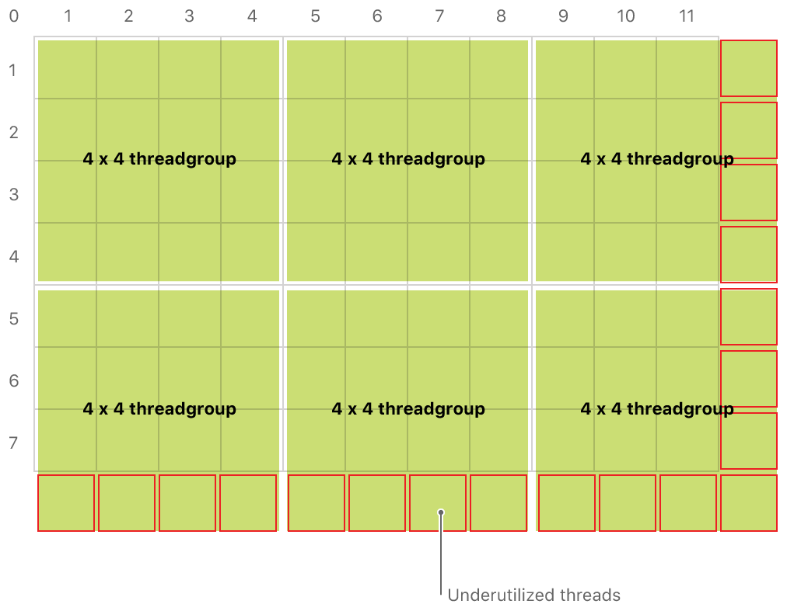

# 使用计算着色器处理纹理

GPU 的浮点吞吐能力远远大于 CPU，因此被设计用来处理渲染相关的任务！但我们不满足 GPU 的局限，如果 GPU 还可以执行通用的计算任务，这将进一步提高程序的执行性能。

[示例程序](https://github.com/Kanthine/MetalCode/tree/main/ComputeShader) 通过将数据写入纹理中，然后使用计算着色器对纹理进行并行计算！你将了解：
* 什么是线程组、什么是 SIMD组？如何划分线程组、SIMD组？
* 并行计算下如何确定每个线程执行的工作；
* 计算着色器如何处理纹理：将颜色值灰度化；
* 如何通过计算着色器读取、写入纹理；

# 1、线程组

在使用计算着色器之前，需要了解 Metal 如何驱动 GPU 进行并行计算！这涉及到一些概念：线程组、SIMD组等！

## 1.1、线程组

在图像处理中，通常以像素为单位，将整个图像划分为一个个__网格__：
* GPU 并行计算像素，每个线程处理一个像素（网格）；
* 为提高并行效率，将多个线程组织为一起执行的__线程组__，共享一个公共内存块；
* 多个线程组覆盖整个网格！



如何识别整个网格中某个线程的具体位置呢？可以通过绝对坐标来识别、也可以通过相对坐标来识别！

标记线程位置的属性限定符有以下几种：
* `[[thread_position_in_grid]]` ： 在整个图像中的某个线程点坐标；
* `[[threadgroup_position_in_grid]]` ：线程组在整个图像中的坐标；
* `[[thread_position_in_threadgroup]]`：线程在线程组中的坐标；


### 1.1.1、绝对坐标

所谓绝对坐标，就是单个线程在整个网格中的坐标位置！通过 `[[thread_position_in_grid]]` 来识别当前线程正在处理的某个像素！


下图是一个 `16x16` 的网格，其中 `8x4` 个网格构成一个线程组，总计有`2x4` 个线程组！红色像素点在网格的坐标是 `(9,10)`！



在计算着色器中，相关代码如下所示：

``` metal
constant half3 kRec709Luma = half3(0.2126, 0.7152, 0.0722);

// 计算着色器
kernel void
grayscaleKernel(texture2d<half, access::read>  inTexture  [[texture(TextureIndexInput)]], /// 输入纹理，只读
                texture2d<half, access::write> outTexture [[texture(TextureIndexOutput)]],/// 输出纹理，只写
                uint2                          gid        [[thread_position_in_grid]]) {  /// 绝对坐标
    /// 判断 gid 是否越界
    if((gid.x >= outTexture.get_width()) || (gid.y >= outTexture.get_height())) return;
    
    half4 inColor  = inTexture.read(gid);                /// 读取纹理的像素值
    half  gray     = dot(inColor.rgb, kRec709Luma);      /// 自定义算法，处理像素值
    outTexture.write(half4(gray, gray, gray, 1.0), gid); /// 将处理后的像素值，写入纹理
}
```

### 1.1.2、相对坐标

线程组相对于整个网格的坐标、线程相对于线程组的坐标，通过这些信息，也可以计算线程的具体位置！

下图是一个 `16x16` 的网格，其中 `8x4` 个网格构成一个线程组，总计有`2x4` 个线程组！
* 红色像素点在整个网格中的坐标是 `(9,10)`，对应 `[[thread_position_in_grid]]`；
* 红色像素点在所属线程组的坐标是 `(1, 2)` 对应 `[[thread_position_in_threadgroup]]`；
* 红色像素点所属的线程组在整个网格中的坐标是 `(1, 2)`， 对应`[[threadgroup_position_in_grid]]`；



我们可以对前面的着色器做一些简单修改；基于线程在其线程组中的位置、线程组的大小、线程组在网格中的位置，计算出线程在整网格中的位置！

``` metal
kernel void 
myKernel(uint2 threadgroup_position_in_grid   [[ threadgroup_position_in_grid ]],   /// 线程组在网格中的位置
         uint2 thread_position_in_threadgroup [[ thread_position_in_threadgroup ]], /// 线程在线程组中的位置 
         uint2 threads_per_threadgroup        [[ threads_per_threadgroup ]]) {      /// 线程组的大小
    
    /// 计算坐标
    uint2 gid = (threadgroup_position_in_grid * threads_per_threadgroup) + 
                thread_position_in_threadgroup;      
}
```

## 1.2、SIMD 组

SIMD 全称 `Single Instruction Multiple Data`，是单指令多数据流:
* 主要用于小碎数据的并行操作：通过一条指令，并行处理多个数据；
* 比如说图像处理，常见的图像数据类型有 `RGB565`、`RGBA8888`、`YUV444` 等格式，这些格式的数据特点是每个像素的单分量总是用小于等于 `８bit` 的数据表示；
* 如果使用传统处理器计算，虽然处理器的寄存器是32位或64位，处理这些数据只使用低８位显得有些浪费；
* 如果把64位寄存器拆成８个８位寄存器就能同时完成８个操作，计算效率提升了８倍，SIMD指令的初衷就是这样；


Metal 将线程组进一步组织为 SIMD 组：每个线程执行相同的代码、从一个线程组分派到另一个线程组的持续时间内保持不变。
* SIMD组中的线程数由计算管线的 `threadExecutionWidth` 属性返回;
* 根据属性限定符，访问线程组中的 SIMD 索引、SIMD 中的线程索引；
    * SIMD组在线程组中的唯一索引 `[[simdgroup_index_in_threadgroup]]`; 
    * 线程在SIMD组中的唯一索引 `[[thread_index_in_simdgroup]]`;

虽然线程组可能是多维的，但SIMD组是一维的。因此线程在 SIMD 组中的位置是一个标量值；而且 SIMD 大小固定、不受线程组大小的影响。

在`16x16`网格中线程组为`8x4`，SIMD组中的线程数为16；单个线程组由两个SIMD组构成、每个SIMD组包含线程组的2行，如下图所示：



线程相对于线程组的坐标为`(1, 2)`：
* 该线程在 SIMD group 的索引`[[thread_index_in_simdgroup]]` 值为 1；
* SIMD组在线程组的索引 `[[simdgroup_index_in_threadgroup]]` 值为 1；



## 1.3、线程组的大小

线程组的大小也不是随意设置的，需要根据 GPU 并发处理的负荷，设计一个适宜的线程组，尽可能确保应用程序中没有未充分利用的线程。

在比 iOS 11 和 macOS 10.13 更早的版本中，需要显式指定每个线程组的线程数！在之后的版本中，Metal 可以分配不定大小的线程组！

### 1.3.1、线程组中尽可能多的线程数

可以根据计算管线的两个属性计算每个线程组的线程数:

```
@protocol MTLComputePipelineState <NSObject>

/// 单个线程组中的最大线程数，取决于 GPU 以及计算着色器所需的寄存器和内存数量
/// 同一个 MTLDevice 上的不同个计算管线可能有不同的最大线程数
@property (readonly) NSUInteger maxTotalThreadsPerThreadgroup;

/// SIMD 组中的线程数；线程组的大小是它的整数倍
@property (readonly) NSUInteger threadExecutionWidth;

@end
```

可以通过下述代码为每个线程组设置尽可能多的线程数：

```
NSUInteger w = pipelineState.threadExecutionWidth;              /// SIMD 组中的线程数
NSUInteger h = pipelineState.maxTotalThreadsPerThreadgroup / w; /// 最大线程数除以 SIMD 组中的线程数
MTLSize threadsPerThreadgroup = MTLSizeMake(w, h, 1);
```

假如有一个计算管线`maxTotalThreadsPerThreadgroup = 512`、`threadExecutionWidth = 32`，那么该渲染管线的 `threadsPerThreadgroup = MTLSizeMake(32, 16, 1)`。

### 1.3.2、非均匀大小的线程组

在支持非均匀线程组大小的设备上，Metal将网格（图像或纹理）划分为任意大小的线程组。

```
/// 传入网格的宽高，由 GPU 划分为任意大小的线程组
MTLSize threadsPerGrid = MTLSizeMake(texture.width, texture.height, 1);
[computeCommandEncoder dispatchThreads:threadsPerGrid          // 整个网格的大小
                 threadsPerThreadgroup:threadsPerThreadgroup]; // 线程组中尽可能多的线程数
```

当 Metal 执行上述代码时，沿着网格的边缘生成更小的线程组。与固定大小的线程组相比，该技术充分利用了每一个线程，提高了 GPU 的性能！

 

由于为每一个像素分配一个线程，没有多余的线程被分配，因此在计算着色器无需判断网格是否越界！

```
kernel void
simpleKernelFunction(texture2d<float, access::write> outputTexture [[texture(0)]],
                     uint2 position [[thread_position_in_grid]]) {
    /// 放心的使用 position，不会超出 outputTexture 的边界
    outputTexture.write(float4(1.0), position);
}
```

### 1.3.3、固定大小的线程组

如果需要精细控制线程组的大小和数量，可以手动计算如何划分网格；此时需要保证有足够的线程组覆盖整个图像。

```
/// 计算得到的小数部分被舍弃
MTLSize threadgroupsPerGrid = MTLSizeMake((texture.width + w - 1) / w, (texture.height + h - 1) / h, 1);

[computeCommandEncoder dispatchThreadgroups:threadgroupsPerGrid     // 需要的线程组个数
                      threadsPerThreadgroup:threadsPerThreadgroup]; // 线程组中尽可能多的线程数
```

例如纹理的分辨率为 `1024x768`:
* 需要的线程组个数为 `threadgroupsPerGrid = MTLSizeMake(32, 48, 1)`，纹理被划分为 `32*48=1536` 个线程组；
* 每个线程组包含 `512` 个线程，总计有 `1536*512=1024x768=786432` 个线程;
* 此时，线程的数量正好与像素数量匹配，GPU 的处理效率得到最好的利用；

再比如纹理的分辨率为 `1920x1080`:
* 需要的线程组个数为 `threadgroupsPerGrid = MTLSizeMake(60, 68, 1)`，纹理被划分为 `60*68=4080` 个线程组；
* 每个线程组包含 `512` 个线程，总计有 `4080*512=2088960` 个线程;
* 总计有 `1920*1080=2073600` 个像素;
* 工作的线程数大与纹理的像素数，这保证了所有像素都会被处理；但线程的利用率没有达到 `100%`!

 

```
kernel void
simpleKernelFunction(texture2d<float, access::write> outputTexture [[texture(0)]],
                     uint2 position [[thread_position_in_grid]]) {
        
    /// 对于上述的 1920x1080 分辨率，可能部分线程是多余的，没有需要处理的像素
    /// 此时需要代码提前退出
    if (position.x >= outputTexture.get_width() || position.y >= outputTexture.get_height()) return;
}
```

# 2、应用程序使用计算管线

## 2.1、计算管线

创建计算管线

```
{
    id<MTLLibrary> defaultLibrary = [_device newDefaultLibrary];
    
    /// 计算着色器
    id<MTLFunction> kernelFunction = [defaultLibrary newFunctionWithName:@"grayscaleKernel"];
    _computePipelineState = [_device newComputePipelineStateWithFunction:kernelFunction error:&error];
}
```


## 2.2、纹理

计算着色器并不能直接处理数据，需要以纹理为媒介，通过对纹理进行并行计算！


创建计算管线的输入纹理:
* `MTLTextureUsageShaderRead` : 计算着色器需要读取纹理

```
{
    MTLTextureDescriptor *textureDescriptor = [[MTLTextureDescriptor alloc] init];
    textureDescriptor.textureType = MTLTextureType2D;
    textureDescriptor.pixelFormat = MTLPixelFormatBGRA8Unorm; /// 像素格式：BGRA8
    textureDescriptor.width  = image.width;
    textureDescriptor.height = image.height;
    textureDescriptor.usage = MTLTextureUsageShaderRead;
    _inputTexture = [_device newTextureWithDescriptor:textureDescriptor];
    
    
    MTLRegion region = {{ 0, 0, 0 }, {textureDescriptor.width, textureDescriptor.height, 1}};
    /// 每行字节数 = 4 (BGRA8) * texture.width
    NSUInteger bytesPerRow = 4 * textureDescriptor.width;
    // 将图像拷贝到 inputTexture 纹理中
    [_inputTexture replaceRegion:region mipmapLevel:0 withBytes:image.data.bytes bytesPerRow:bytesPerRow];
}
```

创建计算管线的输出纹理:
* `MTLTextureUsageShaderWrite`: 计算着色器将处理好的像素写入到该纹理；
* `MTLTextureUsageShaderRead` : 渲染着色器读取该纹理，渲染到屏幕上；

```
{
    MTLTextureDescriptor *textureDescriptor = [[MTLTextureDescriptor alloc] init];
    textureDescriptor.textureType = MTLTextureType2D;
    textureDescriptor.pixelFormat = MTLPixelFormatBGRA8Unorm; /// 像素格式：BGRA8
    textureDescriptor.width  = image.width;
    textureDescriptor.height = image.height;
    textureDescriptor.usage = MTLTextureUsageShaderWrite | MTLTextureUsageShaderRead;
    _outputTexture = [_device newTextureWithDescriptor:textureDescriptor];
}
```

## 2.3、设定线程组

``` objective-c
/// 线程组大小为 16 x 16
_threadgroupSize = MTLSizeMake(16, 16, 1);

/// 线程组个数：需要足够的线程数来覆盖整个图像
_threadgroupCount.width  = (_inputTexture.width  + _threadgroupSize.width -  1) / _threadgroupSize.width;
_threadgroupCount.height = (_inputTexture.height + _threadgroupSize.height - 1) / _threadgroupSize.height;
_threadgroupCount.depth = 1; /// 由于是 2D 图像，所以 depth 设置为 1
```

## 2.4、执行渲染命令

经过计算着色器处理后，在同一个命令缓冲区中继续编码一个渲染管线，将来自 computePass 命令的输出纹理作为 renderPass 的输入纹理。

``` objective-c
- (void)drawInMTKView:(nonnull MTKView *)view {
    /// 为每一帧渲染创建一个命令缓冲区
    id<MTLCommandBuffer> commandBuffer = [_commandQueue commandBuffer];
    commandBuffer.label = @"MyCommand";
    
    /****************** 使用计算着色器处理纹理 ******************/
    id<MTLComputeCommandEncoder> computeEncoder = [commandBuffer computeCommandEncoder]; /// 创建计算编码器
    [computeEncoder setComputePipelineState:_computePipelineState];
    [computeEncoder setTexture:_inputTexture atIndex:TextureIndexInput];
    [computeEncoder setTexture:_outputTexture atIndex:TextureIndexOutput];
    [computeEncoder dispatchThreadgroups:_threadgroupCount threadsPerThreadgroup:_threadgroupSize];
    [computeEncoder endEncoding];
    
    /// 经过计算着色器处理后，在同一个命令缓冲区中继续编码一个渲染管线，将来自 computePass 命令的输出纹理作为 renderPass 的输入纹理
    MTLRenderPassDescriptor *renderPassDescriptor = view.currentRenderPassDescriptor;
    if(renderPassDescriptor == nil) return;
    
    vector_float4 quadVertices[6] = {
        ///                                    几何坐标                     纹理坐标
        simd_make_float4(_viewportSize.x * 0.25, _viewportSize.y * 0.25,   0,  0),
        simd_make_float4(_viewportSize.x * 0.25, _viewportSize.y * 0.75,   0, 1.0),
        simd_make_float4(_viewportSize.x * 0.75, _viewportSize.y * 0.75, 1.0, 1.0),
        
        simd_make_float4(_viewportSize.x * 0.25, _viewportSize.y * 0.25,   0,  0),
        simd_make_float4(_viewportSize.x * 0.75, _viewportSize.y * 0.25, 1.0,  0),
        simd_make_float4(_viewportSize.x * 0.75, _viewportSize.y * 0.75, 1.0, 1.0),
    };
    id<MTLRenderCommandEncoder> renderEncoder = [commandBuffer renderCommandEncoderWithDescriptor:renderPassDescriptor];
    renderEncoder.label = @"MyRenderEncoder";
    [renderEncoder setViewport:(MTLViewport){0.0, 0.0, _viewportSize.x, _viewportSize.y, -1.0, 1.0 }];
    [renderEncoder setRenderPipelineState:_renderPipelineState];
    [renderEncoder setVertexBytes:quadVertices length:sizeof(quadVertices) atIndex:VertexInputIndexVertices];
    [renderEncoder setVertexBytes:&_viewportSize length:sizeof(_viewportSize) atIndex:VertexInputIndexViewportSize];
    [renderEncoder setFragmentTexture:_outputTexture atIndex:TextureIndexOutput];
    [renderEncoder drawPrimitives:MTLPrimitiveTypeTriangle vertexStart:0 vertexCount:6];
    [renderEncoder endEncoding];
    [commandBuffer presentDrawable:view.currentDrawable];
    [commandBuffer commit];
}
```

当 GPU 开始执行缓冲区的命令时，Metal 能够识别 computePass 和 renderPass 之间的命令依赖关系，确保在渲染管线执行之前完成计算管线的命令！ 
