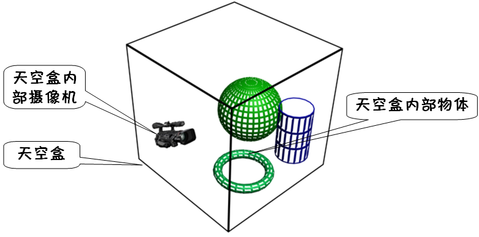
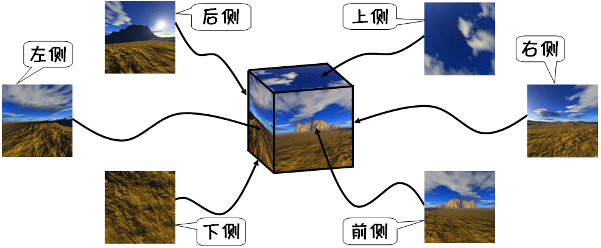
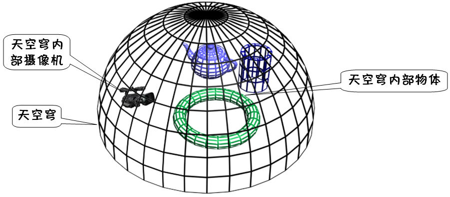
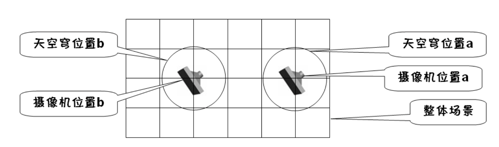

# 天空盒与天空穹

天空盒与天空穹：采用这两种技术可以为场景添加真实的天空效果，增加场景的真实感。

## 天空盒

天空盒技术的思路非常简单，具体说就是将场景放置在一个很大的立方体中，立方体的每个面是一个纹理正方形，如下图所示：

> 使用天空盒时需要注意，用于观察场景的摄像机需要放在天空盒立方体的内部。

为了在观察位于天空盒内部的场景时有真实天空背景的效果，组成天空盒的6个纹理正方形上需要各自映射一幅正方形的天空纹理图。这 6 幅纹理图是可以无缝拼接的，如下图所示。

## 天空穹

从大部分角度观察天空盒都是比较真实的，但当观察天空盒任何两个面的接缝处时真实感就差很多。这是因为构成接缝的两个面成 90°，不是平滑的。这个问题是 天空盒技术所固有的，很难彻底解决，因此，很多游戏场景中会采用另一种天空效果实现技术：天空穹。

天空穹技术中不再是用立方体模拟天空，而是用一个半球面模拟天空，此半球面上需要贴上对应天空的纹理图，如下图所示：

用于模拟天空的半球面切分得越细效果就会越好。但实际开发中出于对性能的考量，切分得不宜过细。

天空穹与天空盒案例效果的对比中可以看出，天空穹的效果会更好一些。 

## 天空盒与天空穹的使用技巧

在很多实际应用中场景非常大，若使用尺寸足以包含整个场景的天空盒或天空穹，效果就不是很好。因此，实际开发时经常会仅让天空盒或天空穹罩住场景的一部分，随着摄像机的 移动天空盒或天空穹也跟着一起移动。

